# SpringAI 完整流程指南

---

## 一、大模型部署方式

大模型的部署方式主要分为以下两种：

| 部署方式 | 说明 | 适用场景 |
|---------|------|---------|
| **云部署** | 租用云服务器，在上面部署大模型 | 快速上手、降低运维成本 |
| **本地部署** | 在自己本地服务器上部署大模型 | 企业级应用、数据安全性要求高 |

> **企业级建议**：本地部署（优点是数据安全）

---

## 二、本次讲解方式

本次讲解使用大模型云平台的API接口方式。如果本地有ollama下载部署的本地模型，也可以使用。

**以阿里云百炼平台为例：**

### 申请API-KEY

注册账号以后还需要申请一个API_KEY才能访问百炼平台的大模型。

在阿里云百炼平台的右上角，鼠标悬停在用户图标上，可以看到下拉菜单：

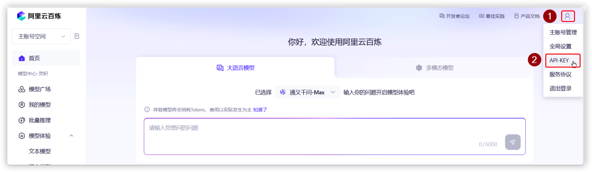

选择`API-KEY`，进入`API-KEY`管理页面：

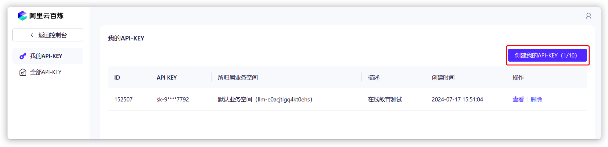

选择`创建我的API-KEY`，会弹出表单：

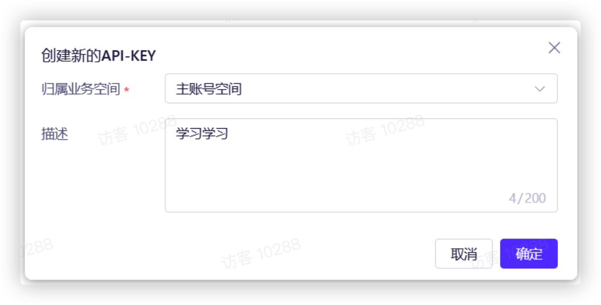

填写完毕，点击确定，即可生成一个新的`API-KEY`：

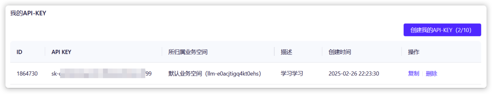

---

## 三、脚手架配置

### 1. 依赖配置

Spring AI 版本号：

```xml
<spring-ai.version>1.1.2</spring-ai.version>
```

完整的 Maven 依赖配置如下：

```xml
<dependency>
    <groupId>org.springframework.ai</groupId>
    <artifactId>spring-ai-bom</artifactId>
    <version>${spring-ai.version}</version>
    <type>pom</type>
    <scope>import</scope>
</dependency>

<!-- 此处以 deepseek 为例 -->
<dependency>
    <groupId>org.springframework.ai</groupId>
    <artifactId>spring-ai-starter-model-openai</artifactId>
    <version>${spring-ai.version}</version>
</dependency>

<dependency>
    <groupId>org.springframework.ai</groupId>
    <artifactId>spring-ai-starter-model-chat-memory-repository-jdbc</artifactId>
    <version>${spring-ai.version}</version>
</dependency>
```

### 2. 脚手架配置文件

```yml
server:
  port: 8084

spring:
  application:
    name: aiModel-service

  # Spring AI Alibaba 配置
  ai:
    chat:
      memory:
        repository:
          jdbc:
            initialize-schema: never
    openai:
      api-key: sk-xxxxxxxxxxxxx
      chat:
        base-url: https://dashscope.aliyuncs.com/compatible-mode
        options:
          model: deepseek-v3.2
          max-tokens: 2000
          temperature: 0.7
```

---

## 四、使用SpringAI核心依赖构建

### 创建 DTO

~~~java
package com.lemon.aiModel.dto;

import lombok.AllArgsConstructor;
import lombok.Data;
import lombok.NoArgsConstructor;

@Data
@NoArgsConstructor
@AllArgsConstructor
public class ChatRequest {
    private String chatId;
    private String message;
}
~~~


### 配置 Bean 实例

~~~java
package com.lemon.aiModel.config;

import org.springframework.ai.chat.client.ChatClient;
import org.springframework.ai.chat.client.advisor.MessageChatMemoryAdvisor;
import org.springframework.ai.chat.client.advisor.SimpleLoggerAdvisor;
import org.springframework.ai.chat.memory.ChatMemory;
import org.springframework.ai.chat.memory.InMemoryChatMemoryRepository;    // 新增：内存存储库
import org.springframework.ai.chat.memory.MessageWindowChatMemory;        // 新增：内存窗口策略
import org.springframework.ai.openai.OpenAiChatModel;
import org.springframework.context.annotation.Bean;
import org.springframework.context.annotation.Configuration;

@Configuration
public class AiConfig {
  
    @Bean
    public ChatClient chatClient(OpenAiChatModel DsModel, ChatMemory chatMemory) {
        return ChatClient
                .builder(DsModel)
                .build();
    }
}

~~~


### 创建 Controller

~~~java
package com.lemon.aiModel.controller;

import com.lemon.aiModel.dto.ChatRequest;
import com.lemon.aiModel.service.AisListHistoryService;
import com.lemon.aiModel.service.impl.AisListHistoryServiceImpl;
import org.springframework.ai.chat.client.ChatClient;
import org.springframework.ai.chat.memory.ChatMemory;
import org.springframework.ai.chat.prompt.Prompt;
import org.springframework.ai.chat.messages.UserMessage;
import org.springframework.beans.factory.annotation.Autowired;
import org.springframework.web.bind.annotation.*;
import reactor.core.publisher.Flux;

import java.util.Map;

@RestController
@RequestMapping("/chat")
public class AiChatController {

    private final ChatClient chatClient;

    @Autowired
    private AisListHistoryService aisListHistoryService;

    public AiChatController(ChatClient chatClient) {
        this.chatClient = chatClient;
    }

    /**
     * 基础聊天接口
     */
    @PostMapping(value = "/send", produces = "text/html;charset=utf-8")
    public String chat(@RequestBody ChatRequest chatRequest) {
        return chatClient.prompt()
                .user(chatRequest.getMessage())
                .call()
                .content();
    }

    /**
     * 流式响应（适合长文本）
     */
    @PostMapping(value = "/streamChat", produces = "text/html;charset=utf-8")
    public Flux<String> streamChat(@RequestBody ChatRequest chatRequest) {
        System.out.println("chatRequest: " + chatRequest);
        aisListHistoryService.saveHistory("chat", chatRequest.getChatId());
        return chatClient.prompt()
                .user(chatRequest.getMessage())
                .advisors(a -> a.param(ChatMemory.CONVERSATION_ID, chatRequest.getChatId()))
                .stream()
                .content();
    }

}
~~~


---

## 五、加载前端页面

此处省略，不是今天的重点。

---

## 六、了解SpringAI的一些核心接口

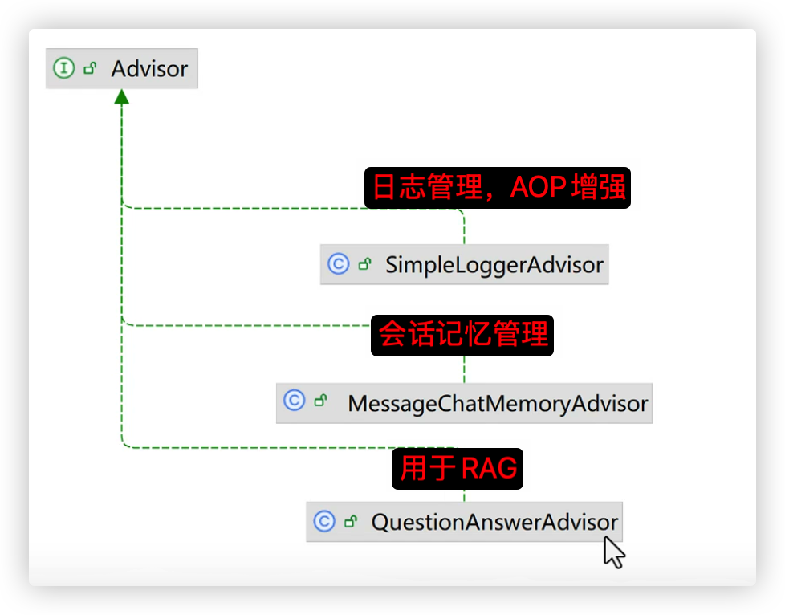

---

## 七、开启日志管理

### 1. 开启日志管理

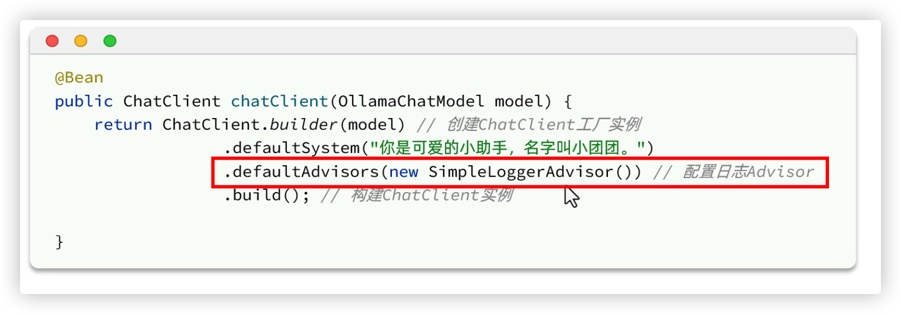

### 2. 底层实现原理

SimpleLoggerAdvisor 实现日志环绕增强的机制并不依赖于传统的 Spring AOP 代理（如 JDK 动态代理或 CGLIB），而是通过**回调函数 + 责任链模式**来完成的。这种设计在 Spring AI 等现代框架中很常见，它轻量、灵活，且与特定执行环境（如 ChatClient 的调用链）深度集成。

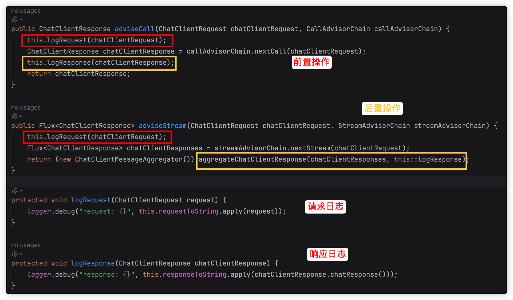

### 3. 验证测试

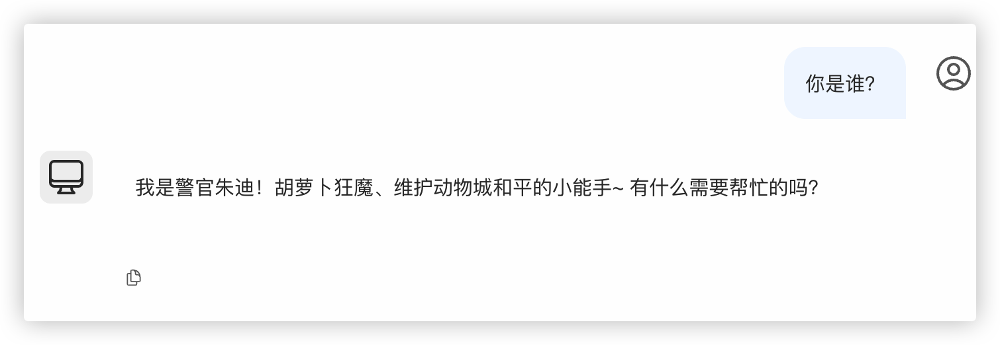

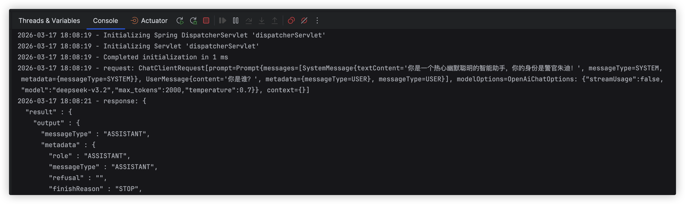


---

## 八、会话记忆

> 首先大模型是不具备记忆能力的，要想让大模型记住之前聊天的内容，唯一的办法就是把之前聊天的内容与新的提示词一起发给大模型。

### 1. OpenAI的API

下面是 OpenAI 的 API（Python）示例：

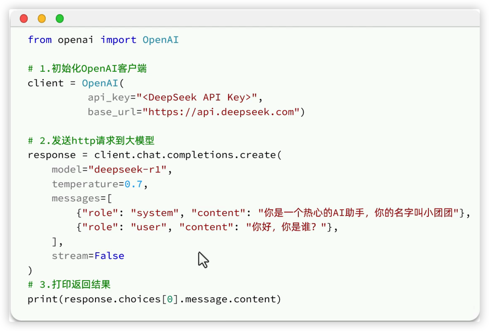


大家可以在阿里云百炼平台进行测试。

### 2. 接口规范

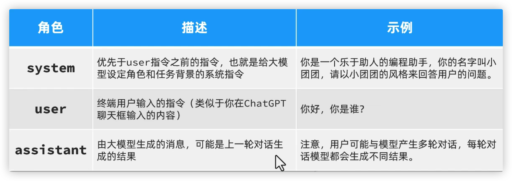

### 3. 会话管理流程

下面是会话管理的流程：

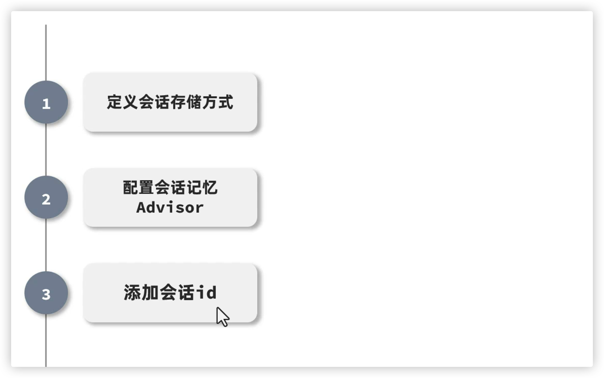


### 4. 会话存储的3种方式

**三种方式：**

1. **自己手动创建 Map 来进行管理**，要使用 ConcurrentHashMap 来保证线程安全，避免数据丢失！

2. **使用 Spring 自带的内存管理**，如下图所示

3. **自己实现企业级的会话 ID 和内容管理**，具体方式可以通过自己新建实现类实现 ChatMemory 接口即可

> 此处演示选择第二种方式，实际开发中要使用第三种方式

以下是会话记忆的接口：

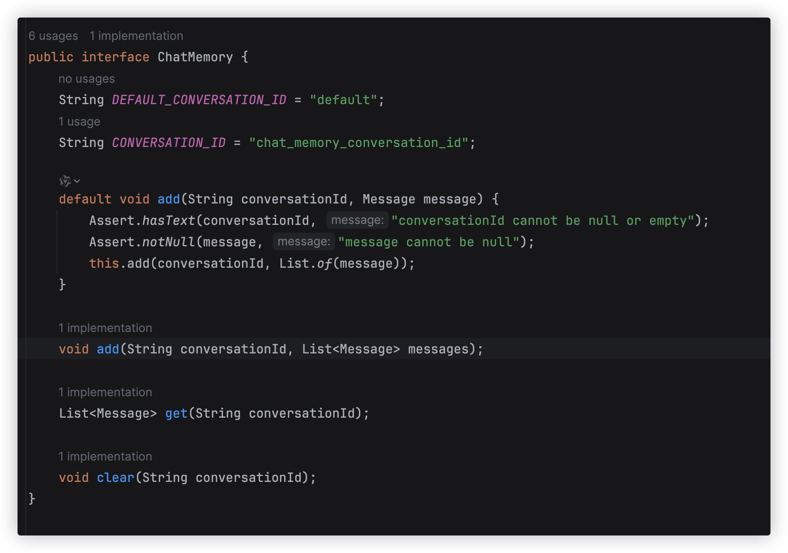

### 5. 配置会话记忆

使用方式：将其配置为 Bean：

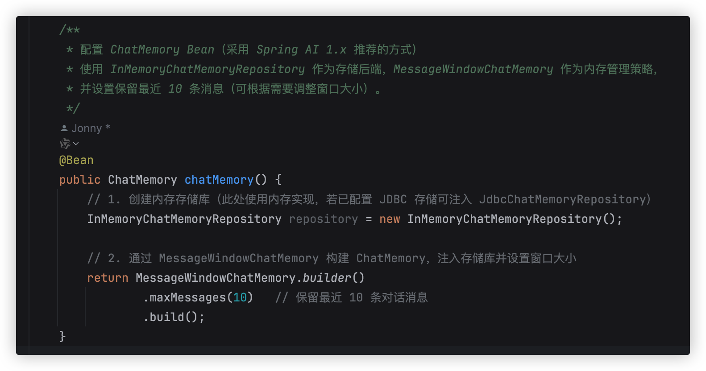

此处选择使用 MessageWindowChatMemory，这是 SpringAI 默认的实现类：

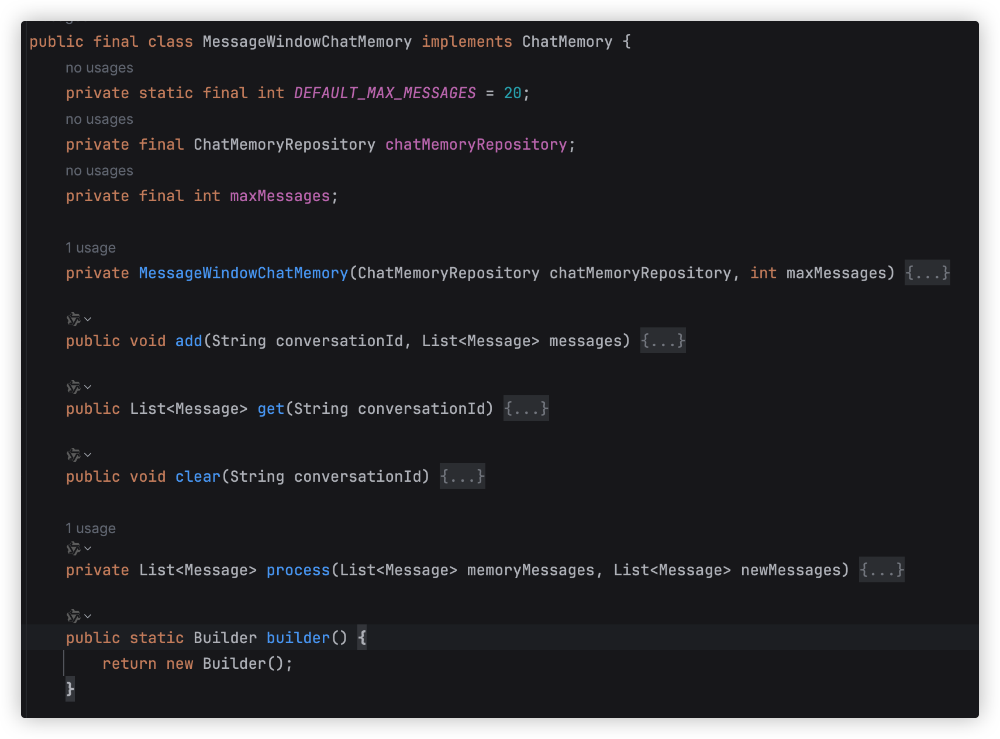

### 6. 管理会话

#### 配置会话记忆

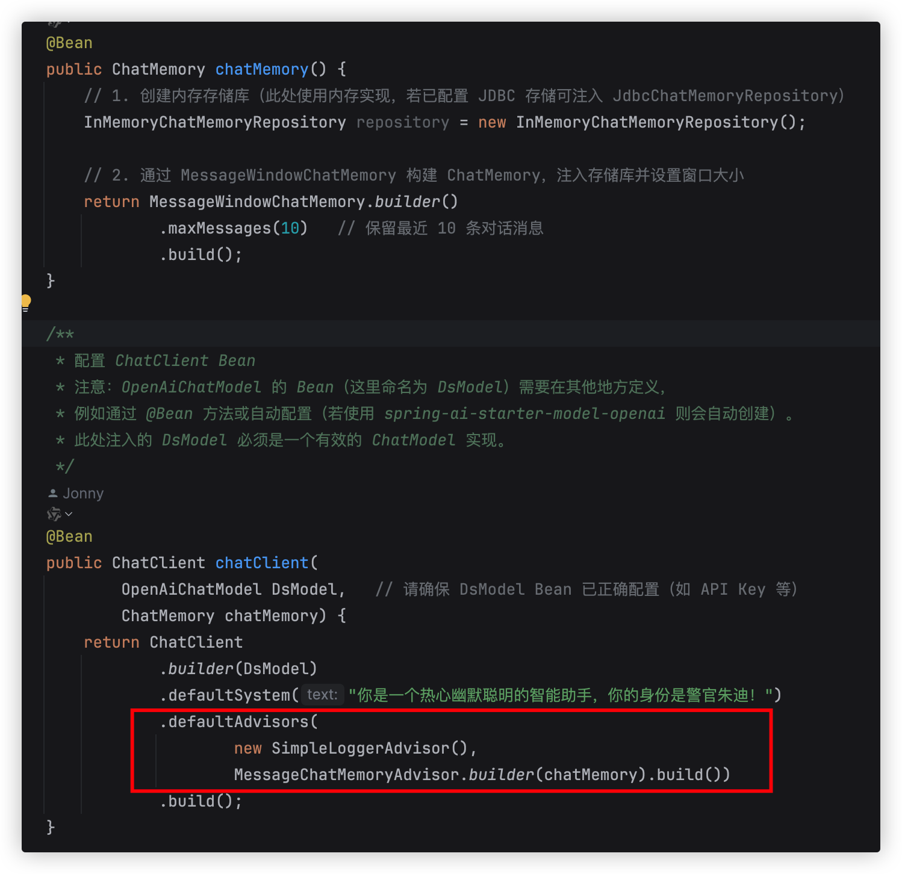


经过如上配置，已经使用了会话管理功能。

那么引出如下问题：**会话 ID 从哪儿来？如何进行管理？**

#### 添加会话 ID

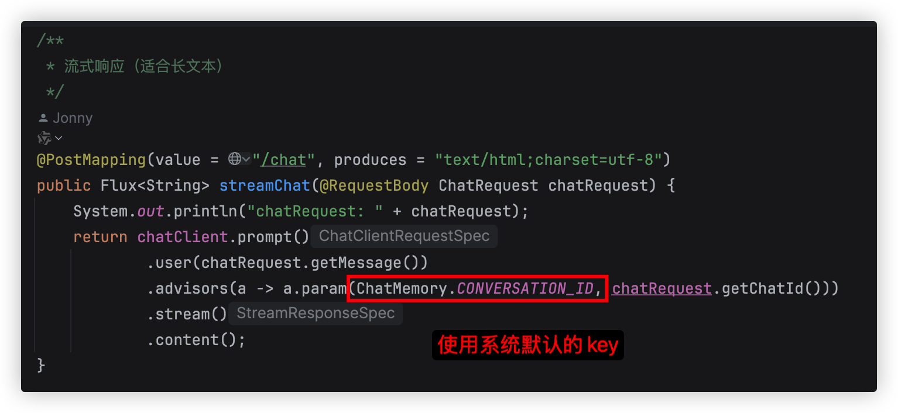

通过源码追溯可以看到其底层还是使用的ConcurrentHashMap来实现的

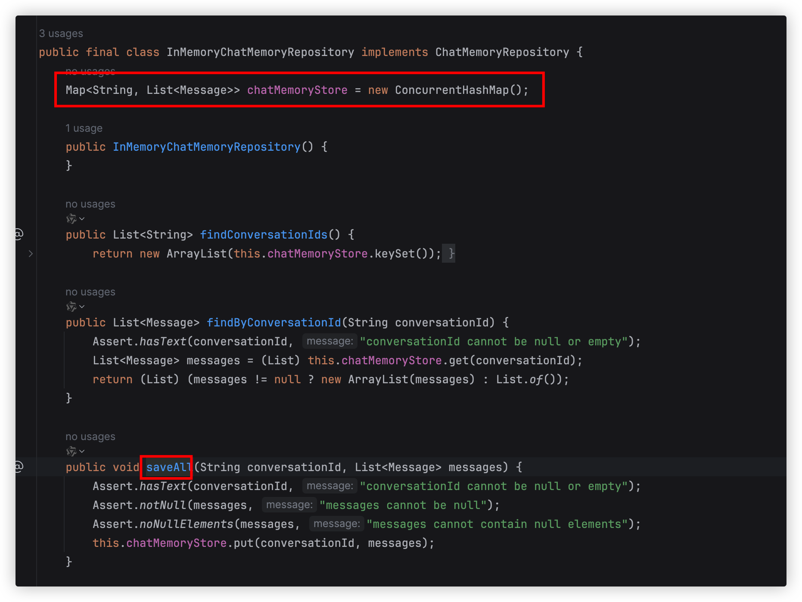

### 7. 验证测试

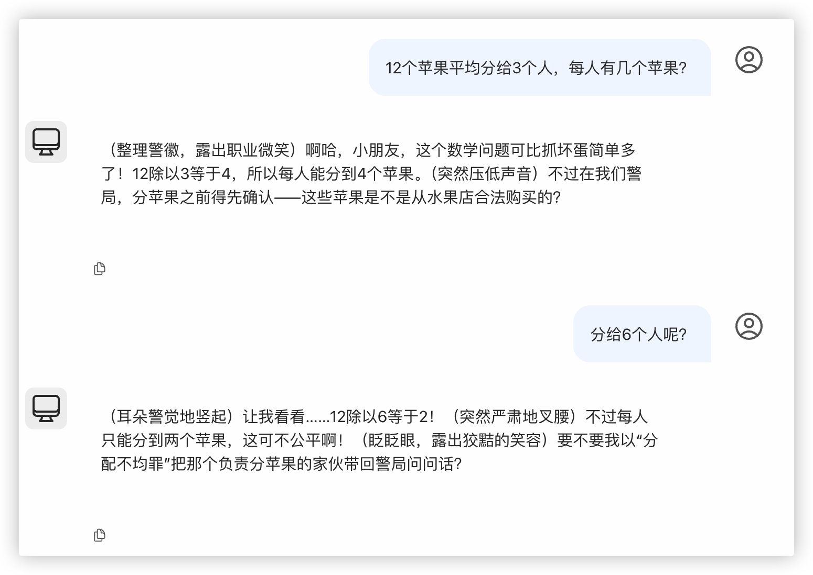

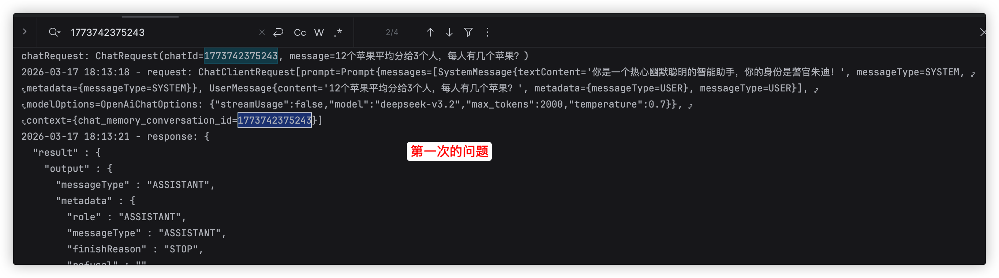

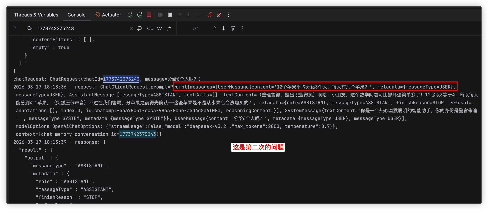


---

## 九、历史数据

### 1. 接口API定义

会话记录列表 API，以及会话详情 API：

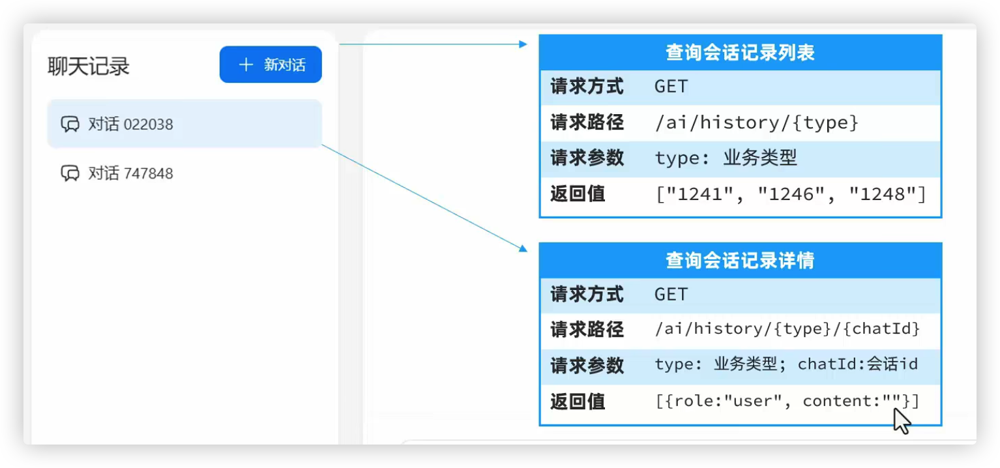

### 2. 实现方式

具体实现（企业级解决方案是将数据入库处理）：

```markdown
1、引入数据库源依赖，mybatis（或mybatisPlus依赖）
2、yml配置文件配置数据库源，配置mybatisplus
3、创建三层架构
4、代码实现
```

### 3. 具体实现

#### (1) 创建表

```sql
CREATE TABLE `ais_list_history` (
    `id` BIGINT UNSIGNED NOT NULL AUTO_INCREMENT COMMENT '主键ID，自增',
    `user_id` VARCHAR(36) NOT NULL COMMENT '用户ID，UUID格式（例如：123e4567-e89b-12d3-a456-426614174000）',
    `chat_id` BIGINT UNSIGNED NOT NULL COMMENT '聊天ID，关联聊天表（假设为数字ID；若也为UUID，可调整为VARCHAR(36)）',
    `biz_type` VARCHAR(50) NOT NULL COMMENT '业务类型，例如：chat(单聊)、group(群聊)、robot(机器人)等',
    `created_at` DATETIME NOT NULL DEFAULT CURRENT_TIMESTAMP COMMENT '创建时间，记录该条历史记录的生成时间',
    `updated_at` DATETIME NOT NULL DEFAULT CURRENT_TIMESTAMP ON UPDATE CURRENT_TIMESTAMP COMMENT '更新时间，记录该条记录的最后修改时间',
    `is_deleted` TINYINT(1) NOT NULL DEFAULT '0' COMMENT '软删除标记：0-未删除，1-已删除',
    `deleted_at` DATETIME DEFAULT NULL COMMENT '删除时间，当is_deleted=1时记录删除的具体时间',
    PRIMARY KEY (`id`),
    KEY `idx_user_id` (`user_id`),
    KEY `idx_chat_id` (`chat_id`),
    KEY `idx_biz_type` (`biz_type`),
    KEY `idx_created_at` (`created_at`),
    KEY `idx_is_deleted` (`is_deleted`),
    KEY `idx_user_deleted` (`user_id`, `is_deleted`)
) ENGINE=InnoDB DEFAULT CHARSET=utf8mb4 COLLATE=utf8mb4_unicode_ci COMMENT='用户列表历史会话id记录表';

ALTER TABLE `ais_list_history`
    ADD COLUMN `rename` VARCHAR(255) DEFAULT NULL COMMENT '重命名后的名称，NULL表示未重命名';
```

#### (2) 创建 POJO 类

```java
package com.lemon.aiModel.pojo;

import com.baomidou.mybatisplus.annotation.*;
import lombok.Data;
import java.time.LocalDateTime;

/**
 * 用户会话记录列表
 */
@Data
@TableName("ais_list_history")
public class AisListHistory {

    /**
     * 主键ID，自增
     */
    @TableId(type = IdType.AUTO)
    private Long id;

    /**
     * 用户ID，UUID格式
     */
    private String userId;

    /**
     * 聊天ID（假设为数字ID，若为UUID则需改为String）
     */
    private Long chatId;

    /**
     * 业务类型，例如：chat(单聊)、group(群聊)、robot(机器人)等
     */
    private String bizType;

    /**
     * 创建时间，自动填充（需配置MetaObjectHandler）
     */
    @TableField(fill = FieldFill.INSERT)
    private LocalDateTime createdAt;

    /**
     * 更新时间，自动填充（需配置MetaObjectHandler）
     */
    @TableField(fill = FieldFill.INSERT_UPDATE)
    private LocalDateTime updatedAt;

    /**
     * 软删除标记：0-未删除，1-已删除
     */
    @TableLogic
    private Integer isDeleted;

    /**
     * 删除时间，当isDeleted=1时记录删除的具体时间
     */
    private LocalDateTime deletedAt;

    /**
     * 聊天名称，用于显示
     */
    @TableField("`rename`")
    private String rename;
}
```

#### (3) 数据库存储

```java
@Override
@Transactional(rollbackFor = Exception.class)
public void saveHistory(String type, String chatId) {
    if (type == null || chatId == null){
        return;
    }
    AisListHistory history = new AisListHistory();
    history.setChatId(Long.valueOf(chatId));
    history.setBizType(type);
    history.setUserId("1");
    history.setCreatedAt(LocalDateTime.now());
    history.setUpdatedAt(LocalDateTime.now());
    this.save(history);
}
```

#### (4) 保存管理

在调用大模型接口前保存数据：

```java
/**
 * 流式响应（适合长文本）
 */
@PostMapping(value = "/streamChat", produces = "text/html;charset=utf-8")
public Flux<String> streamChat(@RequestBody ChatRequest chatRequest) {
    System.out.println("chatRequest: " + chatRequest);
    aisListHistoryService.saveHistory("chat", chatRequest.getChatId());
    return chatClient.prompt()
            .user(chatRequest.getMessage())
            .advisors(a -> a.param(ChatMemory.CONVERSATION_ID, chatRequest.getChatId()))
            .stream()
            .content();
}
```

#### (5) 列表查询

```java
@GetMapping("/{type}")
public R<List<AisListHistory>> list(@PathVariable("type") String type) {
    List<AisListHistory> historyList = aisListHistoryService.getHistoryList(type);
    return historyList != null ? R.success(historyList, "查询成功") : R.fail("记录不存在");
}
```

```java
@Override
public List<AisListHistory> getHistoryList(String type) {
    Assert.notNull(type, "业务类型不能为空");
    log.info("查询业务类型为{}的聊天记录", type);
    LambdaQueryWrapper<AisListHistory> queryWrapper = new LambdaQueryWrapper<>();
    queryWrapper.eq(AisListHistory::getBizType, type);
    queryWrapper.eq(AisListHistory::getIsDeleted, 0);
    return aisListHistoryMapper.selectList(queryWrapper);
}
```

#### (6) 验证测试

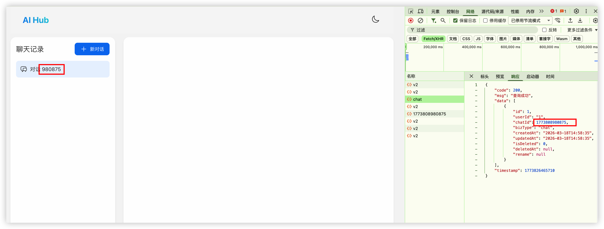

---

## 十、获取会话详情

基本逻辑，从存储会话内容的地方获取内容，搜索并展示。

由于本次演示是使用的 SpringAI 的内存存储，所以需要去内存中获取。

### 1. 新建 VO

```java
package com.lemon.aiModel.vo;

import lombok.Data;
import lombok.NoArgsConstructor;
import org.springframework.ai.chat.messages.Message;

@Data
@NoArgsConstructor
public class MessageVO {
    private String role;
    private String content;

    // 默认数据直接从Message中获取
    public MessageVO(Message message) {
        switch (message.getMessageType()) {
            case USER:
                this.role = "user";
                break;
            case ASSISTANT:
                this.role = "assistant";
                break;
            case SYSTEM:
                this.role = "system";
                break;
            default:
                this.role = "unknown";
        }
        this.content = message.getText();
    }
}
```

### 2. 实现类实现

```java
@Autowired
private AisListHistoryMapper aisListHistoryMapper;

@Autowired
private ChatMemory chatMemory;

@Override
public List<MessageVO> getMessageInfo(String type, Long id) {
    Assert.notNull(id, "业务ID不能为空");
    // 从内存管理中获取数据
    List<Message> messages = chatMemory.get(String.valueOf(id));
    // 变更数据结构并返回
    return messages.stream().map(MessageVO::new).toList();
}
```

### 3. 验证测试

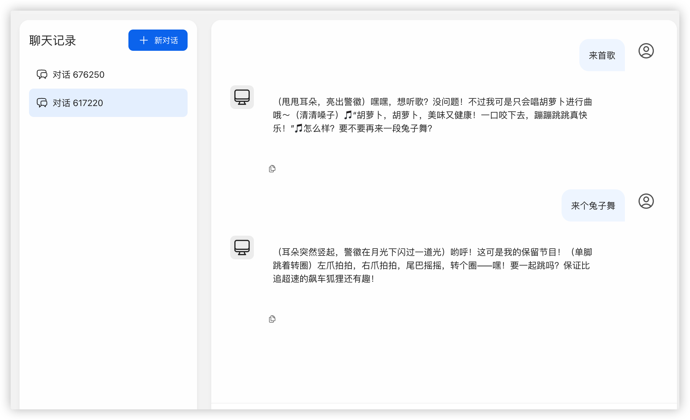

符合预期。

---

## 十一、总结

本文档详细介绍了基于 SpringAI 框架构建 AI 对话机器人的完整流程，主要涵盖以下核心内容：

### 1. 大模型部署方案

- **云部署**：通过阿里云百炼等平台提供的 API 接口快速接入，适合快速开发验证
- **本地部署**：使用 Ollama 等工具在本地部署，数据安全性更高，适合企业级应用

### 2. 技术架构要点

| 模块 | 关键技术 | 说明 |
|-----|--------|-----|
| 依赖配置 | SpringAI BOM + OpenAI Starter | 版本管理 + 云平台接入 |
| 会话记忆 | ChatMemory + MessageWindowChatMemory | 实现大模型的多轮对话能力 |
| 日志管理 | SimpleLoggerAdvisor | 责任链模式实现请求响应日志 |
| 历史数据 | MyBatis-Plus + JDBC | 企业级持久化存储方案 |

### 3. 核心实现流程

```
用户请求 → Controller → Service → ChatClient
                                      ↓
                               ChatMemory (会话记忆)
                                      ↓
                               百炼平台 API (大模型)
                                      ↓
                               返回响应 → 保存历史记录
```

### 4. 关键设计思想

- **会话隔离**：通过 `conversationId` 实现多会话并行管理
- **软删除设计**：历史数据采用逻辑删除，便于数据恢复和审计
- **责任链模式**：日志管理采用回调函数 + 责任链，轻量灵活
- **分层架构**：DTO → Service → Controller，职责清晰

### 5. 生产环境建议

1. **会话存储**：推荐使用自定义实现类 + 数据库存储，而非内存管理
2. **数据安全**：敏感数据脱敏处理，API Key 加密存储
3. **性能优化**：考虑引入缓存层，减少数据库压力
4. **监控告警**：添加请求耗时、错误率等指标监控

---

**文档整理**：尼克

**整理日期**：2026年3月20日

