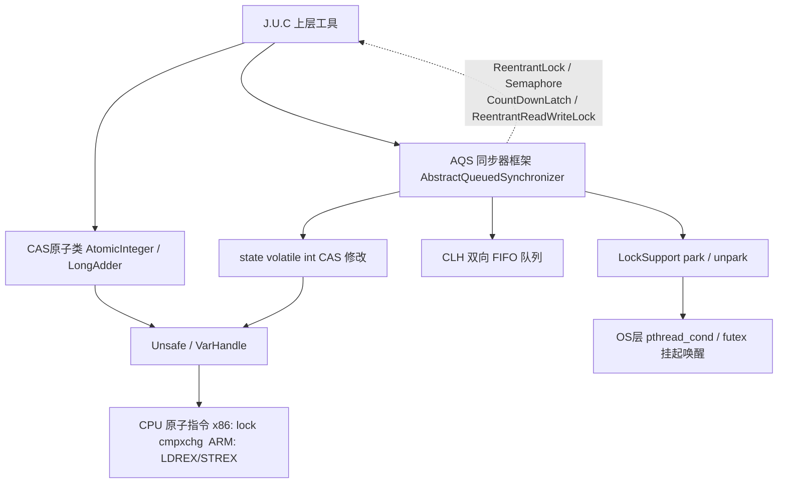
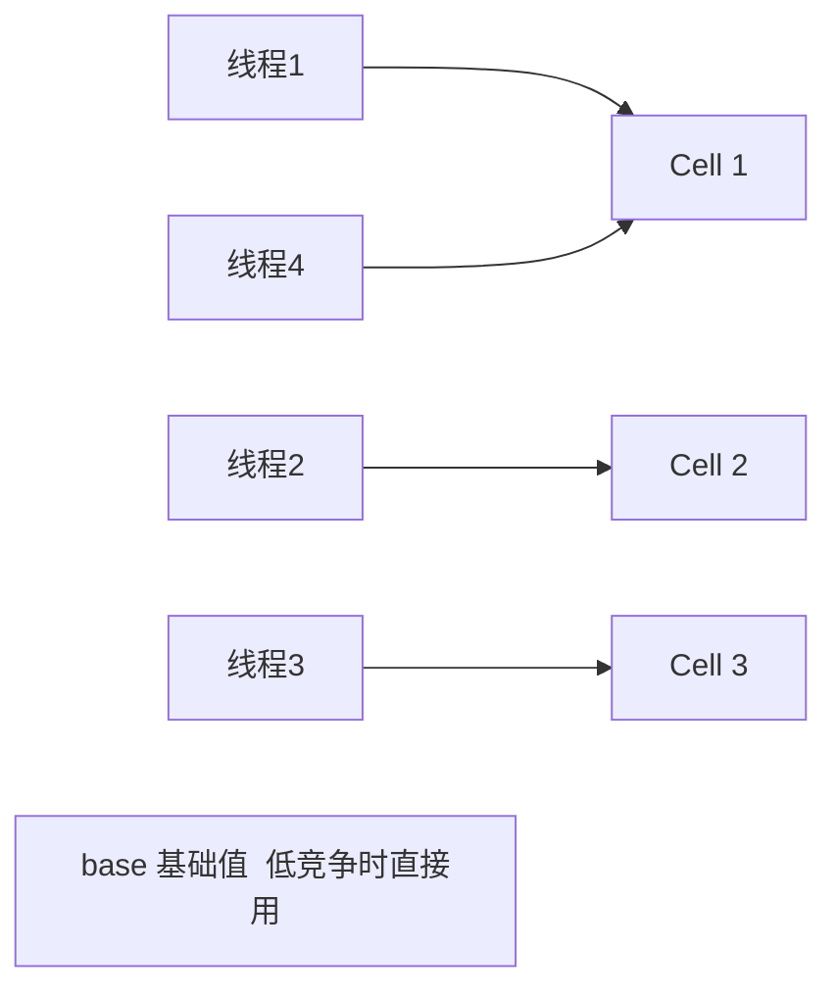
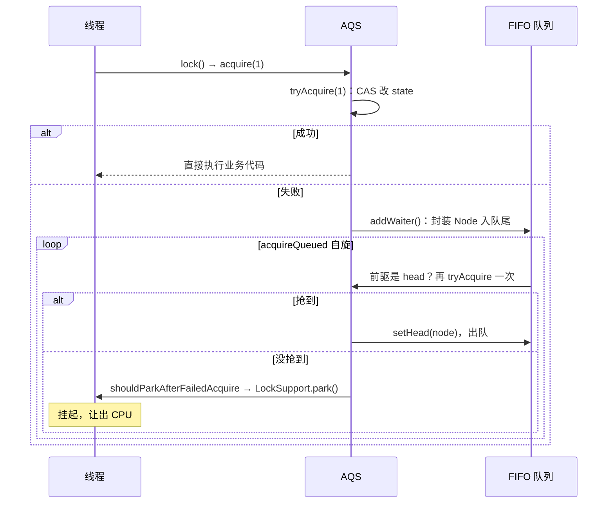
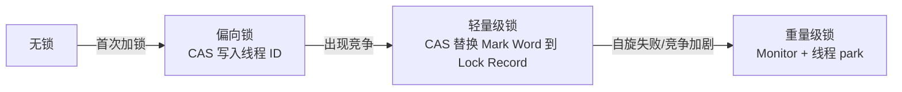
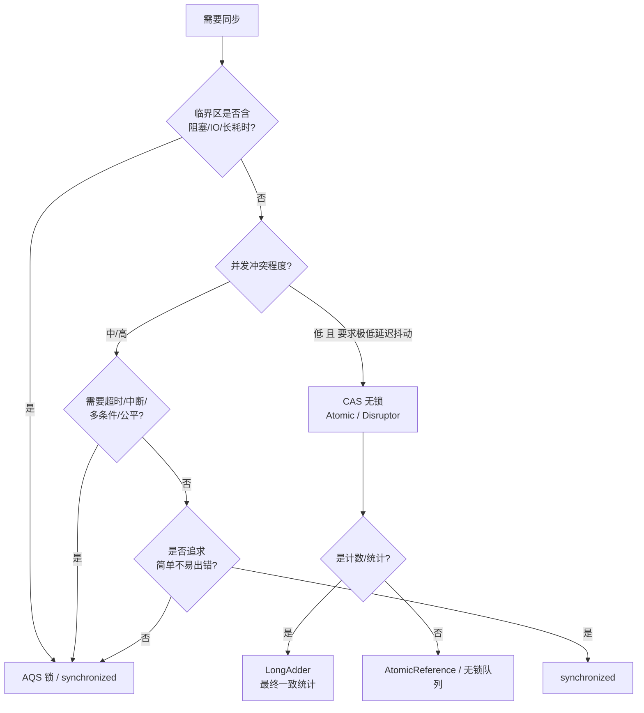

# CAS / AQS 深度解析与实战

> 主题：CAS、AQS、LockSupport(park/unpark)、Thread.join()、公平/非公平锁、无锁 vs 加锁选型
> 适用：Java 8 ~ Java 21（涉及版本差异处已标注）
> 定位：从「会用」到「能讲清原理 + 能排错 + 能扛追问」的并发底层笔记

---

## 1. 全景图：三者的层次关系



**一句话定位：**

- **CAS** 是 CPU 硬件原子指令，是**最小粒度的乐观并发原语**，不是 Java 语法。
- **AQS** 是 Java 层的**同步器模板框架**，本身不是锁；它用 CAS 改 `state`，用队列管理线程，用 `park/unpark` 挂起唤醒。
- **LockSupport** 是 JVM 提供的**线程阻塞/唤醒工具**，是 AQS 阻塞能力的底座。
- 三者是**层次关系，不是互斥关系**：AQS 内部大量使用 CAS，抢锁失败才 park。

---

## 2. CAS：硬件原子指令

### 2.1 定义与语义

`Compare-And-Swap`：三参数 `V(内存地址)、A(预期旧值)、B(新值)`。

1. 读取内存 V 当前值；
2. `V == A` → 未被其他线程修改，写入 B，返回成功；
3. `V != A` → 已被修改，**不做任何变更**，返回失败。

> 整段「比较 + 交换」由**一条 CPU 指令**完成，中间不可被中断，因此具备原子性。
> - x86：`lock cmpxchg`（`lock` 前缀锁总线/缓存行，保证独占）
> - ARM：底层无 CAS 指令，用 LL/SC（`LDREX` / `STREX`）模拟

伪代码（自旋重试的经典形态）：

```java
while (true) {
    int old = getCurrentValue();      // 读
    int next = old + 1;               // 算
    if (compareAndSwap(V, old, next)) // 写（原子）
        return next;
    // 失败：说明被别人改了，重新读、重新来
}
```

### 2.2 Java 层的三个入口

| 层级 | API | 说明 |
| --- | --- | --- |
| 应用层 | `AtomicInteger / AtomicLong / AtomicReference` | 推荐，语义清晰 |
| 底层 | `Unsafe.compareAndSwapInt(o, offset, expect, update)` | JDK 8 内部实现，不建议业务直接用 |
| 现代 | `VarHandle.compareAndSet(...)` | JDK 9+ 官方替代，支持更细的内存序（opaque/acquire/release） |

**JDK 8 `AtomicInteger` 的 `getAndAddInt` 源码（循环 CAS 的教科书实现）：**

```java
// sun.misc.Unsafe (JDK 8)
public final int getAndAddInt(Object o, long offset, int delta) {
    int v;
    do {
        v = getIntVolatile(o, offset);          // volatile 读，保证看到最新值
    } while (!compareAndSwapInt(o, offset, v, v + delta));
    return v;
}
// incrementAndGet() = getAndAddInt(this, valueOffset, 1) + 1
```

> JDK 9 起内部逐步迁移到 `VarHandle`/`JDK.internal.misc.Unsafe`，但「读取—计算—CAS 重试」的循环形态不变。

### 2.3 三大缺陷与对策

| 缺陷 | 现象 | 解决方案 |
| --- | --- | --- |
| **ABA** | 值 A→B→A，CAS 误判为「未变更」 | `AtomicStampedReference`（版本戳）/ `AtomicMarkableReference`（布尔标记） |
| **自旋空转** | 高竞争下 CPU 飙高甚至雪崩 | 退化为 `LongAdder` 分段；或改用 AQS 锁让失败线程 park |
| **只能原子更新单个变量** | 多个变量无法一起原子 | 封装成不可变对象，用 `AtomicReference`；或加锁 |

#### ABA 复现与修复（**修正版**，修复了原版的时序 Bug）

```java
import java.util.concurrent.atomic.AtomicStampedReference;

public class AbaDemo {
    public static void main(String[] args) throws InterruptedException {
        // 初始值 100，初始版本号 0
        AtomicStampedReference<Integer> ref = new AtomicStampedReference<>(100, 0);

        int oldStamp = ref.getStamp();        // 主线程先记住版本号
        Integer oldVal = ref.getReference();

        Thread hacker = new Thread(() -> {
            int s1 = ref.getStamp();
            System.out.println("干扰线程：100 -> 200, stamp " + s1 + " -> " + (s1 + 1));
            ref.compareAndSet(100, 200, s1, s1 + 1);   // 100 -> 200

            int s2 = ref.getStamp();                     // 重新读，已是 s1+1
            System.out.println("干扰线程：200 -> 100, stamp " + s2 + " -> " + (s2 + 1));
            ref.compareAndSet(200, 100, s2, s2 + 1);   // 200 -> 100（值回到原点）
        }, "干扰线程");

        hacker.start();
        hacker.join();   // ✅ 关键：必须等干扰线程跑完，否则主线程 CAS 结果不确定

        // 值仍然是 100，但版本号已从 0 变成 2 → CAS 失败，ABA 被识别
        boolean success = ref.compareAndSet(oldVal, 300, oldStamp, oldStamp + 1);
        System.out.println("当前值 = " + ref.getReference() + "，当前版本 = " + ref.getStamp());
        System.out.println("CAS 是否成功：" + success);   // false
    }
}
```

#### 🔴 必踩的坑：Integer 缓存与引用比较

```java
AtomicStampedReference<Integer> r = new AtomicStampedReference<>(1000, 0);
boolean ok = r.compareAndSet(1000, 2000, 0, 1);
System.out.println(ok);   // false！！！
```

`AtomicStampedReference.compareAndSet` 内部用 `==` **比较引用**（不是 `equals`）：

```java
expectedReference == current.reference && expectedStamp == current.stamp && ...
```

`1000` 超出 `Integer` 缓存范围 `[-128, 127]`，`Integer.valueOf(1000)` 每次都是**新对象**，引用不同 → 必然失败。
**结论：包装 `Integer` 时只用 `[-128,127]` 内的值，或改用自定义不可变对象。**

### 2.4 高竞争下的正解：LongAdder

`AtomicLong` 在高并发计数时，所有线程 CAS 同一个 `value`，冲突率极高 → 大量自旋。**`LongAdder` 用「空间换时间」分段化解：**



- 低竞争：直接 CAS `base`；
- 高竞争：每个线程按 `probe` 散列到不同 `Cell`，**热点从 1 个点分散到 N 个点**；
- 取值：`sum()` = `base` + 所有 `Cell` 累加，**不是原子快照**（统计用，不要用于精确扣款余额）；
- 精确场景：用 `LongAccumulator` 或 `AtomicLong`。

**伪共享（False Sharing）**：多个 `Cell` 若落在同一 CPU 缓存行（通常 64B），一个写会导致其他核缓存行失效，性能反降。`Striped64` 的 `Cell` 用 `@Contended`（JDK 8 为 `sun.misc.Contended`，JDK 9+ 为 `jdk.internal.vm.annotation.Contended`）做缓存行填充解决。

```java
LongAdder adder = new LongAdder();
// 多线程并发：adder.increment();
long total = adder.sum();   // 最终一致，非原子快照
```

### 2.5 适用场景

| ✅ 适合 | ❌ 不适合 |
| --- | --- |
| 计数器、序列号、状态标记位 | 大量线程同时争抢同一变量（冲突剧烈） |
| 冲突低、临界区极短（几条指令） | 临界区内有阻塞/IO/耗时操作 |
| 对**延迟毛刺**极度敏感的核心链路 | 需要条件等待、超时、中断的复杂同步 |
| Disruptor 无锁队列、行情推送、订单内存撮合 | 需要多变量一致性 |

### 2.6 代码示例：基础计数

```java
import java.util.concurrent.atomic.AtomicInteger;

public class CasDemo {
    public static void main(String[] args) throws InterruptedException {
        AtomicInteger counter = new AtomicInteger(0);

        Runnable task = () -> {
            for (int i = 0; i < 5000; i++) {
                counter.incrementAndGet();   // 内部循环 CAS 自旋
            }
        };
        Thread t1 = new Thread(task, "t1");
        Thread t2 = new Thread(task, "t2");
        t1.start();
        t2.start();
        t1.join();   // 等待子线程计数完成，主线程再读结果
        t2.join();
        System.out.println("结果：" + counter.get());   // 10000
    }
}
```

---

## 3. AQS：同步器框架

`AbstractQueuedSynchronizer` —— J.U.C 并发包的**同步器模板**，本身不是锁。
`ReentrantLock`、`Semaphore`、`CountDownLatch`、`ReentrantReadWriteLock`、`ThreadPoolExecutor.Worker` 全部依赖它。

### 3.1 三大核心组件

| 组件 | 说明 |
| --- | --- |
| **`state`（volatile int）** | 同步状态，通过 CAS 修改；语义由子类定义 |
| **CLH 变体双向 FIFO 队列** | 存放抢锁失败的线程（`Node` 双向链表） |
| **模板方法** | `tryAcquire/tryRelease/tryAcquireShared/tryReleaseShared/isHeldExclusively` 由子类实现 |

**`state` 语义对照表（面试常考）：**

| 同步器 | state 含义 | 模式 |
| --- | --- | --- |
| `ReentrantLock` | 0=空闲；>0=已持有，数值=**重入次数** | 独占 |
| `Semaphore` | 剩余许可数 | 共享 |
| `CountDownLatch` | 计数值，减到 0 放行 | 共享 |
| `ReentrantReadWriteLock` | 高 16 位=读锁持有数，低 16 位=写锁重入数 | 独占+共享 |

```java
// 读写锁的位切分
static final int SHARED_SHIFT   = 16;
static final int SHARED_UNIT    = (1 << SHARED_SHIFT);   // 读锁 +1
static final int EXCLUSIVE_MASK = (1 << SHARED_SHIFT) - 1;// 写锁掩码
int sharedCount(int c)   { return c >>> SHARED_SHIFT; }  // 读锁数
int exclusiveCount(int c){ return c & EXCLUSIVE_MASK; }  // 写锁数
```

### 3.2 两种工作模式

| 模式 | 获取 | 释放 | 典型实现 |
| --- | --- | --- | --- |
| 独占 EXCLUSIVE | `tryAcquire(int)` | `tryRelease(int)` | `ReentrantLock` |
| 共享 SHARED | `tryAcquireShared(int)`（返回 <0 失败） | `tryReleaseShared(int)` | `Semaphore`、`CountDownLatch`、读锁 |

### 3.3 解决什么问题

> CAS 冲突大时自旋会耗尽 CPU。
> AQS：CAS 抢锁失败后**不无限自旋** → 线程封装成 `Node` 入队 → `park()` 挂起释放 CPU → 锁释放时 `unpark` 唤醒后继。

### 3.4 Node 与 waitStatus

```java
static final class Node {
    volatile int waitStatus;
    volatile Node prev;
    volatile Node next;
    volatile Thread thread;
    Node nextWaiter;   // 条件队列的后继 / 模式标记
}
```

| waitStatus | 值 | 含义 |
| --- | --- | --- |
| `CANCELLED` | 1 | 线程已取消（超时/中断），**需从队列剔除** |
| `SIGNAL` | -1 | 后继节点正在等待，**当前节点释放时必须 unpark 后继** |
| `CONDITION` | -2 | 节点在**条件队列**中（`Condition.await`） |
| `PROPAGATE` | -3 | 共享模式下，释放需**向后传播**（解决 JDK 早期 bug） |
| 0 | 0 | 初始/无状态 |

**为什么是双向链表（CLH 变体）？**

1. 取消节点时需要 `prev` 完成「跳过 CANCELLED 节点」的断链；
2. unparkSuccessor：`next` 在并发取消时可能不可靠，所以需要` 从 `tail` **向前**遍历找最近的有效后继；（unparkSuccessor是**释放锁的时候，唤醒下一个等待线程**的方法。）
3. `shouldParkAfterFailedAcquire` 需要检查/修改**前驱节点**的 `waitStatus`。

### 3.5 获取锁完整流程 acquire()



**关键源码解读（`acquireQueued`）：**

```java
final boolean acquireQueued(final Node node, int arg) {
    boolean failed = true;
    try {
        boolean interrupted = false;
        for (;;) {
            final Node p = node.predecessor();
            // 只有前驱是 head 才有资格抢锁 —— 维持 FIFO 公平性
            if (p == head && tryAcquire(arg)) {
                setHead(node);          // 自己成为 head（虚节点，thread=null）
                p.next = null;          // 帮助 GC
                failed = false;
                return interrupted;
            }
            // 前驱状态设为 SIGNAL 后才敢安心 park
            if (shouldParkAfterFailedAcquire(p, node) && parkAndCheckInterrupt())
                interrupted = true;     // 被中断：只记录，不抛（acquire 不可中断）
        }
    } finally {
        if (failed) cancelAcquire(node);
    }
}
```

`shouldParkAfterFailedAcquire` 三分支：

1. 前驱 `ws == SIGNAL` → 可以安全 park，返回 true；
2. 前驱 `ws > 0`（CANCELLED）→ 向前跳过所有取消节点；
3. 否则 → CAS 把前驱 `ws` 改成 `SIGNAL`，本轮不 park（再试一次抢锁）。

> ❗ **`park` 会被虚假唤醒（spurious wakeup）**，所以整个逻辑必须在 `for(;;)` 循环里 —— 这也是 `Object.wait` 必须写在 `while` 循环中的同一道理。
>
> ❗ **线程被唤醒 ≠ 拿到锁**：唤醒后需重新 `tryAcquire` 竞争，**可能被新来的插队线程抢走，也可能再次 park**。

### 3.6 释放锁完整流程 release()

```java
public final boolean release(int arg) {
    if (tryRelease(arg)) {          // 子类把 state 改回去
        Node h = head;
        if (h != null && h.waitStatus != 0)
            unparkSuccessor(h);     // 唤醒 head 之后的第一个有效节点
        return true;
    }
    return false;
}

private void unparkSuccessor(Node node) {
    int ws = node.waitStatus;
    if (ws < 0) compareAndSetWaitStatus(node, ws, 0);
    Node s = node.next;
    // next 为空或已取消 → 从 tail 向前找最近的未取消节点（体现双向链表的价值）
    if (s == null || s.waitStatus > 0) {
        s = null;
        for (Node t = tail; t != null && t != node; t = t.prev)
            if (t.waitStatus <= 0) s = t;
    }
    if (s != null) LockSupport.unpark(s.thread);
}
```

### 3.7 共享模式的传播（`PROPAGATE`）

共享（如 `Semaphore`）释放后，不止一个线程可以拿到资源，因此必须**连续唤醒多个后继**，靠 `doReleaseShared()` + `setHeadAndPropagate()` 递归传播：

```java
private void doReleaseShared() {
    for (;;) {
        Node h = head;
        if (h != null && h != tail) {
            int ws = h.waitStatus;
            if (ws == Node.SIGNAL) {
                if (!compareAndSetWaitStatus(h, SIGNAL, 0)) continue;
                unparkSuccessor(h);              // 唤醒后继
            }
            else if (ws == 0 &&
                     !compareAndSetWaitStatus(h, 0, Node.PROPAGATE))
                continue;                        // 保证传播继续
        }
        if (h == head) break;                    // head 未变化则结束
    }
}
```

共享模式各同步器 `tryAcquireShared` 的写法：

```java
// Semaphore（非公平）：剩余许可够就扣减
final int nonfairTryAcquireShared(int acquires) {
    for (;;) {
        int available = getState();
        int remaining = available - acquires;
        if (remaining < 0 || compareAndSetState(available, remaining))
            return remaining;      // >=0 成功，<0 失败
    }
}

// CountDownLatch：计数为 0 才放行
protected int tryAcquireShared(int acquires) {
    return (getState() == 0) ? 1 : -1;
}
```

### 3.8 Condition 条件队列

`ConditionObject` 是 AQS 的内部类，维护**另一条单向条件队列**：

1. `await()`：把当前线程从**同步队列**移到**条件队列**，释放全部锁（`fullyRelease`），然后 park；
2. `signal()`：把条件队列首节点**迁移回同步队列**，改 `waitStatus` 为 SIGNAL，等待重新抢锁；
3. `signalAll()`：迁移全部节点。

> ⚠️ 自定义 AQS 若要用 `Condition`，必须正确重写 **`isHeldExclusively()`**，否则抛 `IllegalMonitorStateException`。

```java
Condition notFull = lock.newCondition();
lock.lock();
try {
    while (queue.size() == CAPACITY) notFull.await();   // 必须在 while 中
    queue.add(e);
} finally { lock.unlock(); }
```

### 3.9 完整可重入独占锁 Demo（**重写：支持重入 + Condition**）

```java
import java.util.concurrent.locks.AbstractQueuedSynchronizer;
import java.util.concurrent.locks.Condition;
import java.util.concurrent.locks.ReentrantLock;

public class MyReentrantAqsLock {

    private final Sync sync = new Sync();

    private static class Sync extends AbstractQueuedSynchronizer {
        // 判断当前线程是否独占持锁（Condition 依赖）
        @Override
        protected boolean isHeldExclusively() {
            return getExclusiveOwnerThread() == Thread.currentThread();
        }

        // 独占获取：state==0 抢锁；否则判断重入
        @Override
        protected boolean tryAcquire(int acquires) {
            final Thread current = Thread.currentThread();
            int c = getState();
            if (c == 0) {
                // 注意：这里用 hasQueuedPredecessors() 可实现公平锁
                if (compareAndSetState(0, acquires)) {
                    setExclusiveOwnerThread(current);
                    return true;
                }
            } else if (current == getExclusiveOwnerThread()) {
                // 重入：state 累加
                int nextc = c + acquires;
                if (nextc < 0) throw new Error("===>>>Maximum lock count exceeded");
                setState(nextc);      // 已是持锁线程，无需 CAS
                return true;
            }
            return false;
        }

        // 释放：重入计数归零才算真正释放
        @Override
        protected boolean tryRelease(int releases) {
            int c = getState() - releases;
            if (Thread.currentThread() != getExclusiveOwnerThread())
                throw new IllegalMonitorStateException();
            boolean free = false;
            if (c == 0) {
                free = true;
                setExclusiveOwnerThread(null);
            }
            setState(c);
            return free;   // 返回 false 表示还在重入中，不唤醒后继
        }

        final int getHoldCount() {
            return getState();
        }

        final Condition newCondition() { return new ConditionObject(); }
    }

    public void lock()              { sync.acquire(1); }
    public void unlock()            { sync.release(1); }
    public void lockInterruptibly() throws InterruptedException { sync.acquireInterruptibly(1); }
    public boolean tryLock(long millis) throws InterruptedException { return sync.tryAcquireNanos(1, millis * 1_000_000L); }
    public int getHoldCount()       { return sync.getHoldCount(); }
    public Condition newCondition() { return sync.newCondition(); }

    public static void main(String[] args) throws InterruptedException {
        MyReentrantAqsLock lock = new MyReentrantAqsLock();

        Runnable task = () -> {
            lock.lock();
            try {
                System.out.println(Thread.currentThread().getName() + " 获取锁，计数=" + lock.getHoldCount());
                lock.lock();   // 重入
                try {
                    System.out.println(Thread.currentThread().getName() + " 重入，计数=" + lock.getHoldCount());
                    Thread.sleep(1000);
                } finally {
                    lock.unlock();
                    System.out.println(Thread.currentThread().getName() + " 第一次释放锁，计数=" + lock.getHoldCount());
                }
            } catch (InterruptedException e) {
                Thread.currentThread().interrupt();
            } finally {
                lock.unlock();
                System.out.println(Thread.currentThread().getName() + " 第二次释放锁，计数=" + lock.getHoldCount());
            }
        };

        Thread t1 = new Thread(task, "线程1");
        Thread t2 = new Thread(task, "线程2");
        t1.start(); t2.start();
        t1.join();  t2.join();
    }
}

```

### 3.10 AQS 额外能力（synchronized 给不了的）

| 能力 | API |
| --- | --- |
| 可中断获取 | `acquireInterruptibly` / `lockInterruptibly()` |
| 超时获取 | `tryAcquireNanos` / `tryLock(timeout)` |
| 非阻塞尝试 | `tryLock()` |
| 多条件变量 | `newCondition()`（一把锁可挂多个等待队列） |
| 公平/非公平可切 | `new ReentrantLock(true)` |
| 可查询状态 | `getQueueLength()`、`hasQueuedThreads()`、`getHoldCount()` |

### 3.11 AQS 适用场景与禁忌

| ✅ 适合 | ❌ 不适合 |
| --- | --- |
| 锁竞争激烈，不允许 CPU 空转 | 极致低延迟交易链路（park/unpark 引入 OS 调度抖动） |
| 需要可中断 / 超时 / 条件变量 / 公平性 | 临界区只有几条指令、且冲突极低（CAS 更划算） |
| 后台清算对账、DB 交互、批处理 | — |

---

## 4. LockSupport：park / unpark

### 4.1 核心语义

```java
LockSupport.park();          // 阻塞当前线程，进入 WAITING，让出 CPU，不再消耗 CPU
LockSupport.unpark(thread);  // 给指定线程发放「许可」，唤醒被 park 的线程
```

### 4.2 许可（permit）机制三大要点

1. **许可上限为 1**：连续两次 `unpark`，许可仍是 1（不累加）；
2. **先 unpark 后 park，线程不会阻塞**（许可已提前拿到，直接放行）；—— 这是 `wait/notify` 做不到的（先 notify 后 wait 会永久等待）；
3. **不需要任何锁**：`park` 不要求在 `synchronized` 块中，与 `wait/notify` 解耦。

### 4.3 补充要点

- **可被中断，但不抛异常**：线程被 interrupt 时 `park()` 立即返回，仅设置中断标志，需自己调 `Thread.interrupted()` 判断；AQS 的 `parkAndCheckInterrupt()` 正是如此。
- **虚假唤醒**：`park` 可能无理由返回，**必须放在循环中**。
- **带 blocker 的重载**：`park(Object blocker)` 会把 blocker 记录到线程，便于 `jstack`/JFR 排查「卡在哪个锁上」——`ReentrantLock` 内部就用它。
- **限时版本**：`parkNanos(long)`（纳秒）→ `TIMED_WAITING`；`parkUntil(long)`（绝对毫秒时间戳）。

### 4.4 四种「等待」方式对比

| 维度 | `Thread.sleep` | `Object.wait` | `LockSupport.park` | `Condition.await` |
| --- | --- | --- | --- | --- |
| 是否释放锁 | ❌ 不释放 | ✅ 释放 monitor | ❌ 不涉及锁 | ✅ 释放 Lock |
| 需要持有锁 | ❌ | ✅ 必须在 synchronized | ❌ | ✅ 必须先 lock |
| 唤醒方式 | 时间到 | `notify/notifyAll` | `unpark` / 中断 | `signal/signalAll` |
| 先唤醒后等待 | — | ❌ 丢失（永久等） | ✅ 许可保留 | ❌ 丢失 |
| 目标 | 自己 | 随机/全体 | **精确指定线程** | 等待同一 Condition |
| 中断 | 抛 `InterruptedException` 并清标志 | 同左 | **不抛异常，仅置标志** | 抛或保留（可选） |
| 线程状态 | `TIMED_WAITING` | `WAITING` | `WAITING` | `WAITING` |

### 4.5 Demo

```java
import java.util.concurrent.locks.LockSupport;

public class ParkDemo {
    static final Object BLOCKER = new Object();   // 仅用于诊断展示

    public static void main(String[] args) throws InterruptedException {
        Thread t = new Thread(() -> {
            System.out.println("子线程准备 park 阻塞");
            // 传入 blocker（此处用线程自身对象）便于 jstack 看到「卡在谁身上」
            LockSupport.park(ParkDemo.BLOCKER);
            System.out.println("子线程被唤醒，继续运行，中断标志="
                    + Thread.currentThread().isInterrupted());
        }, "worker");
        t.start();

        Thread.sleep(2000);
        System.out.println("主线程 2s 后 unpark 子线程");
        LockSupport.unpark(t);
    }
}
```

> 最简写法直接 `LockSupport.park()`；生产代码建议用 `park(Object blocker)`，诊断时 `jstack` 会显示 `parking to wait for <blocker 地址>`，能快速定位等待的锁对象。

**先 unpark 后 park 不阻塞（验证许可机制）：**

```java
Thread t = new Thread(() -> {
    LockSupport.unpark(Thread.currentThread());  // 自己先发许可
    LockSupport.park();                          // 直接放行，不阻塞
    System.out.println("park 未阻塞，许可生效");
});
t.start();
```

---

## 5. Thread.join / sleep / yield

### 5.1 join()

`thread.join()`：**让当前调用线程阻塞，等待目标线程执行完毕后再继续。**

| 重载 | 语义 |
| --- | --- |
| `join()` | 无限等待直到目标线程结束 |
| `join(long millis)` | 最多等 millis 毫秒，超时不再阻塞 |
| `join(long millis, int nanos)` | 纳秒级精度（实际受 OS 时钟粒度限制） |

**底层原理（源码级）：**

```java
// java.lang.Thread（JDK 8）
public final synchronized void join(long millis) throws InterruptedException {
    long base = System.currentTimeMillis();
    long now = 0;
    if (millis < 0) throw new IllegalArgumentException("timeout value is negative");
    if (millis == 0) {
        while (isAlive()) {       // 必须用 while：防止虚假唤醒
            wait(0);              // 在当前 Thread 对象上等待
        }
    } else {
        while (isAlive()) {
            long delay = millis - now;
            if (delay <= 0) break;
            wait(delay);
            now = System.currentTimeMillis() - base;
        }
    }
}
```

- `join` 是 **synchronized 方法**（锁对象是该 `Thread` 实例），内部用 `wait`；
- **子线程终止时，JVM 在 `Thread.join` 的锁对象上执行 `notify_all`**（HotSpot 层调用 `ensure_join()` → `lock.notify_all(thread)`），唤醒所有等待者；
- 会抛 `InterruptedException`（受检异常），捕获后中断状态已被清除，需按语义处理。

> **CAS 示例中的 `join` 用途**：防止主线程在子线程计数完成前打印结果（避免读到中间值 0 或残缺值）。
> 现代写法更推荐 `CountDownLatch`（不依赖线程生命周期，可复用、可超时）：

```java
CountDownLatch latch = new CountDownLatch(2);
// 子线程 finally 中：latch.countDown();
latch.await(5, TimeUnit.SECONDS);
```

### 5.2 sleep vs yield

| | `Thread.sleep(ms)` | `Thread.yield()` |
| --- | --- | --- |
| 语义 | 休眠指定时间 | 提示调度器「可以出让 CPU」，**不保证生效** |
| 锁 | 不释放已持有的锁 | 不释放锁 |
| 状态 | `TIMED_WAITING` | `RUNNABLE` |
| 用途 | 定时/限流/退避 | 自旋退让（几乎被 `onSpinWait()` 取代） |

> JDK 9+ 提供 `Thread.onSpinWait()`，在自旋循环中提示 CPU（x86 上编译为 `PAUSE` 指令），降低功耗与流水线惩罚 —— **写 CAS 自旋循环的标准做法**。

---

## 6. 公平锁 vs 非公平锁（ReentrantLock）

|  | 非公平锁（**默认**） | 公平锁 |
| --- | --- | --- |
| 代码 | `new ReentrantLock()` | `new ReentrantLock(true)` |
| 逻辑 | 新线程上来**直接 CAS 抢锁**，无视队列，允许插队 | 抢锁前先 `hasQueuedPredecessors()`，队列有人在等就直接排队 |
| 吞吐量 | **高** | 较低（可差一个数量级） |
| 饥饿风险 | 存在（理论上） | 无 |

**非公平锁吞吐更高的真实原因：**

> 唤醒一个被 park 的线程，从 `unpark` 到真正恢复运行存在**可观的空档**（内核态/用户态切换、恢复上下文、加载缓存）。非公平锁允许新线程在空档期「插队」直接用完临界区再释放，**把这段空档利用起来**；公平锁则必须严格排队，白白浪费空档并多付一次上下文切换代价。

**源码差异只在一处：**

```java
// 公平锁：多一个「是否有人在排队」的前置判断
protected final boolean tryAcquire(int acquires) {
    final Thread current = Thread.currentThread();
    int c = getState();
    if (c == 0) {
        if (!hasQueuedPredecessors() &&          // ← 公平性关键
            compareAndSetState(0, acquires)) {
            setExclusiveOwnerThread(current);
            return true;
        }
    }
    // ...重入逻辑同前
}
```

> 另一个重要差异：**非公平锁的 `lock()` 会先偷偷 CAS 一次**（`compareAndSetState(0,1)`），失败才走 `acquire()`；`tryLock()` 本身就是非公平的，即使你是公平锁。

> 结论：**绝大多数场景用非公平锁**。只有对执行顺序/等待时间有强约束（如避免长尾饥饿、合规审计要求 FIFO）才启用公平锁。

---

## 7. synchronized 与 AQS 的关系

| 维度 | `synchronized` | `ReentrantLock`(AQS) |
| --- | --- | --- |
| 实现层 | JVM 关键字，对象头 Mark Word + Monitor（`ObjectMonitor`） | Java 层，CAS + 队列 + park |
| 释放锁 | 自动（代码块/方法退出） | **必须手动 `unlock()`，写进 `finally`** |
| 可中断 | ❌ 不可中断 | ✅ `lockInterruptibly()` |
| 超时 | ❌ | ✅ `tryLock(timeout)` |
| 公平性 | 只能非公平 | 可选 |
| 条件队列 | 1 个（wait/notify） | 多个 `Condition` |
| 性能 | JDK 6 后大幅优化，低/中竞争下**不输甚至更优** | 高竞争、需高级特性时更优 |

**锁升级（JDK 8）中的 CAS 身影：**



- 偏向锁、轻量级锁的获取**都用 CAS**，失败才膨胀为重量级锁（此时底层线程阻塞同样依赖 `park`）；
- ⚠️ **JDK 15（JEP 374）起偏向锁已被弃用并默认关闭**，新版本逐步移除——现代 JVM 直接从**无锁 → 轻量级锁 → 重量级锁**。
- JIT 还会做 **锁消除**（逃逸分析发现不会共享）与 **锁粗化**（连续小锁合并）。

---

## 8. 选型决策：CAS 无锁 vs AQS 锁 vs synchronized



| 场景 | 推荐 |
| --- | --- |
| 简单互斥、临界区短、不想管释放 | `synchronized`（自动释放，最不易出错） |
| 统计计数（高竞争） | `LongAdder` |
| 统计计数（需精确/读多） | `AtomicLong` |
| 状态机、标志位、序列号 | `AtomicInteger` / `AtomicReference` |
| 需要超时/中断/多条件/公平/可查询 | `ReentrantLock` |
| 限流 | `Semaphore` |
| 线程编排/一次性 | `CountDownLatch` |
| 读多写少 | `ReentrantReadWriteLock` / `StampedLock` |
| 超高吞吐流水线 | `Disruptor`（无锁环形队列） |

> **关键区分：**
>
> - CAS 无锁：失败**一直自旋，绝不 park**；
> - AQS：先 CAS 抢一次，失败则 **park 挂起**。

---

## 9. 金融/低延迟等场景实战建议

### ✅ CAS 自旋无锁（Disruptor / AtomicXXX）

- 适用：**锁冲突低、对延迟抖动极度敏感**的核心交易链路、订单内存队列、行情推送。
- 心法：**宁可少量 CPU 自旋，也坚决避免线程 park 挂起/唤醒带来的 OS 调度抖动。**
- Disruptor 关键技术点：环形数组预分配（避免 GC）、序号屏障、缓存行填充（消除伪共享）、`WaitStrategy` 可选 `BusySpin` / `Yielding`（低延迟）或 `Blocking`（省 CPU，内部即 `LockSupport`）。

### ⚠️ CAS 禁忌

- 并发冲突极高的场景：大量线程自旋抢同一变量 → CPU 占满 → 性能雪崩；
- 此时改用 `LongAdder`（分散热点）或 AQS 锁（让失败线程 park）。

### ✅ AQS 锁（ReentrantLock）

- 适用：**竞争激烈**、后台清算对账、DB 交互、允许少量延迟抖动、需要高级锁特性；
- 抢锁失败 park 释放 CPU，保护 CPU 资源；
- 务必：
  - `unlock()` 放 **`finally`**，防锁泄漏；
  - 持锁期间**不做远程调用/回调**，防死锁与长尾；
  - 统一加锁顺序，防死锁。

### 🔒 通用工程建议

1. 优先用 J.U.C 现成组件，**不要轻易自己写 AQS**；
2. 压测用 **JMH**，别用 `System.currentTimeMillis()` 手搓基准（JIT 会骗你）；
3. 出问题时用 `jstack` 查 `BLOCKED`/`WAITING (parking)`，`LockSupport` 带 blocker 时能看到具体锁对象；
4. 中断：捕获 `InterruptedException` 后**恢复中断标志**（`Thread.currentThread().interrupt()`），不要吞掉。

---

## 10. 小结汇总

**1. 什么是 CAS？底层原理？**
> CPU 硬件提供的原子指令（乐观锁原语），三参数 `V(内存值)、A(预期值)、B(新值)`；V==A 才写入 B 并返回成功。x86 为 `lock cmpxchg`（带 lock 前缀锁定缓存行/总线），ARM 用 LL/SC 模拟。Java 层通过 `Unsafe`/`VarHandle` 暴露，供 `AtomicXXX` 与 AQS 使用。

**2. CAS 的三大问题及解决？**
> ① ABA → `AtomicStampedReference`（版本戳）/ `AtomicMarkableReference`；② 自旋 CPU 空转 → 冲突高时改 `LongAdder` 或 AQS 锁；③ 只能原子更新单个变量 → 封装不可变对象用 `AtomicReference`，或加锁。

**3. ABA 有什么实际危害？举例。**

> 栈/链表结构复用的场景最危险：栈顶 A 被弹出、压入 B、再压回 A（可能对象已变），CAS 会误判成功导致链表断裂。业务语义上「值相同但已被改过」也可能造成重复扣款/重复发券。

**4. AQS 是什么？核心组成？**

> J.U.C 的同步器模板框架，本身不是锁。三件套：① `volatile int state`（CAS 修改，语义由子类定义）；② CLH 变体**双向 FIFO 阻塞队列**；③ 模板方法 `tryAcquire/tryRelease/tryAcquireShared/tryReleaseShared/isHeldExclusively`。

**5. ReentrantLock 加锁完整流程？**
> `lock()` → `sync.acquire(1)` → `tryAcquire` CAS 把 state 从 0 改 1 并记录 owner；成功直接返回；失败 `addWaiter` 封装 Node 入队尾 → `acquireQueued` 循环：前驱是 head 则再抢一次，否则 `shouldParkAfterFailedAcquire` 把前驱置为 SIGNAL 后 `LockSupport.park()`。

**6. 释放锁流程？**
> `unlock()` → `release(1)` → `tryRelease` 把 state 减到 0 并清空 owner → `unparkSuccessor(head)` 找到最近的有效后继 → `LockSupport.unpark(thread)`。

**7. 被 unpark 唤醒就代表拿到锁吗？**

> **不是。** 唤醒只是从 park 返回、进入 RUNNABLE，必须回到 `acquireQueued` 循环重新 `tryAcquire`；若被新来的插队线程抢先（非公平锁），会再次 park。

**8. 为什么 AQS 队列是双向链表？**

> ① 取消节点需靠 `prev` 跳过 CANCELLED 完成断链；② `unparkSuccessor` 要从 tail **向前**遍历找有效后继（`next` 在并发取消时不可靠）；③ 需要读写前驱的 `waitStatus`（SIGNAL）。

**9. waitStatus 有哪些状态？**
> `CANCELLED(1)` 已取消、`SIGNAL(-1)` 需唤醒后继、`CONDITION(-2)` 在条件队列、`PROPAGATE(-3)` 共享释放需传播、`0` 初始。

**10. 公平锁与非公平锁区别？为什么默认非公平？**

> 非公平：新线程直接 CAS 插队，无视队列；公平：先 `hasQueuedPredecessors()` 判断有无排队。默认非公平是为**吞吐**——唤醒线程有空档期，插队可把空档利用起来，减少一次上下文切换。

**11. `tryLock()` 是公平的吗？**

> 不是。`tryLock()` 直接调用 `nonfairTryAcquire`，**即使是公平锁也会插队**。

**12. park 与 wait 的区别？**
> `wait` 必须在 `synchronized` 块内、会释放 monitor、靠 `notify` 唤醒、先 notify 后 wait 会丢失；`park` 不需要锁、不涉及 monitor、靠 `unpark`、有**许可机制**（先 unpark 后 park 不阻塞）、可被中断但**不抛异常只置标志**。

**13. 为什么 park 要放在循环里？**
> 存在**虚假唤醒**（spurious wakeup）；且唤醒后不一定抢到锁，必须循环重试——`acquireQueued` 就是 `for(;;)`。

**14. 可重入性怎么实现？**
> `state` 记录重入次数 + `exclusiveOwnerThread` 记录持有者。同一线程再次获取时判断 owner 是自己 → `state++` 直接成功（无需 CAS）；释放时 `state--`，归零才真正释放并唤醒后继。

**15. 读写锁如何用 state 表示两种锁？**
> `int` 拆两半：高 16 位 = 读锁持有数（`sharedCount`），低 16 位 = 写锁重入数（`exclusiveCount`）。

**16. 共享模式的传播（PROPAGATE）为什么存在？**
> 共享资源释放后可能唤醒多个线程，需 `doReleaseShared` 持续向后传播；`PROPAGATE` 状态是修复 JDK 早期「并发释放时传播中断导致后续线程无法唤醒」的 bug。

**17. Condition 的 await/signal 原理？**
> AQS 内部类 `ConditionObject` 维护独立的**单向条件队列**；`await()` 释放全部锁并把节点移入条件队列 park；`signal()` 把节点迁回同步队列等待重新抢锁。自定义 AQS 必须重写 `isHeldExclusively()`。

**18. synchronized 和 ReentrantLock 怎么选？**
> 简单互斥、不想管释放 → `synchronized`（自动释放，JVM 已深度优化，低中竞争下性能不差）。需要超时、中断、多条件队列、公平性、可查询状态 → `ReentrantLock`。

**19. 高并发计数用 AtomicLong 还是 LongAdder？**
> 高写低读的统计计数 → `LongAdder`（分段 Cell 分散热点，吞吐高，但 `sum()` 非原子快照）。需要精确值/读多写少/做 CAS 判断 → `AtomicLong`。

**20. Disruptor 为什么不用 AQS？**
> 交易场景冲突低且对延迟毛刺零容忍；AQS 竞争失败会 park 线程，park/unpark 涉及内核调度，会带来**微秒级抖动**；Disruptor 选择 CAS 自旋 + 环形数组 + 缓存行填充，把延迟压到极致。

**21. CAS 什么时候该改成 AQS 锁？**
> 冲突不大、追求极致低延迟抖动 → CAS；冲突激烈、不允许 CPU 空转、业务可接受抖动 → AQS 锁。

**22. join() 的作用与底层原理？**
> 当前线程等待目标线程结束；`join` 是 `synchronized` 方法，内部 `while(isAlive()) wait(0)`；子线程终止时 JVM 在 Thread 对象上 `notify_all` 唤醒等待者；会抛 `InterruptedException`。

---

## 11. 速查表 & 常见错误清单

### 11.1 一句话速查

| 关键词 | 一句话总结 |
| --- | --- |
| CAS | CPU 原子指令，乐观并发，失败自旋，绝不 park |
| ABA | 值回退误判 → 版本戳 `AtomicStampedReference` |
| 高竞争计数 | `LongAdder` 分段 + `@Contended` 防伪共享 |
| AQS | state + 双向队列 + park/unpark 的模板框架 |
| state | 锁的重入数 / 许可数 / 计数值 / 读写锁高低 16 位 |
| SIGNAL | 前驱欠后继一次 unpark |
| PROPAGATE | 共享释放要继续往后传 |
| 唤醒 ≠ 拿锁 | 唤醒后必须重新 tryAcquire，可能再次 park |
| 非公平默认 | 利用唤醒空档提升吞吐 |
| park | 不需要锁、有许可、可先 unpark、中断不抛异常 |
| join | synchronized + wait，线程结束 JVM notify_all |
| 自旋优化 | JDK 9+ `Thread.onSpinWait()`（x86 PAUSE） |

### 11.2 ❌ 常见错误清单

| # | 错误 | 后果 | 正确做法 |
| --- | --- | --- | --- |
| 1 | `unlock()` 没放 `finally` | 异常导致**锁永久泄漏** | 一律 `try{...} finally{ lock.unlock(); }` |
| 2 | 自定义 AQS 不重写 `isHeldExclusively()` | 用 `Condition` 抛 `IllegalMonitorStateException` | 按当前线程判断 owner |
| 3 | `AtomicStampedReference` 装 `Integer` 且值 >127 | `==` 引用比较**必然失败** | 用缓存范围内的值，或自定义不可变对象 |
| 4 | 用 `LongAdder.sum()` 做余额/精确扣减 | 非原子快照，结果不准 | 精确场景用 `AtomicLong` / 锁 |
| 5 | 吞掉 `InterruptedException` | 中断信号丢失，线程无法优雅停止 | 恢复 `Thread.currentThread().interrupt()` |
| 6 | 持锁期间做 RPC / DB / 回调 | 长尾 + 死锁风险 | 先算后锁，锁内只做内存操作 |
| 7 | 用 `sleep` 轮询代替条件等待 | 延迟高、CPU 浪费 | `Condition.await/signal` 或 `BlockingQueue` |
| 8 | 高竞争下无脑 `AtomicLong.incrementAndGet` | CPU 打满、吞吐雪崩 | `LongAdder` |
| 9 | 写了自旋循环不加退让提示 | 功耗高、流水线惩罚 | `Thread.onSpinWait()` / `yield` / 退避策略 |
| 10 | 以为公平锁能解决所有饥饿 | 吞吐大幅下降 | 默认非公平，仅在顺序有强要求时启用 |

