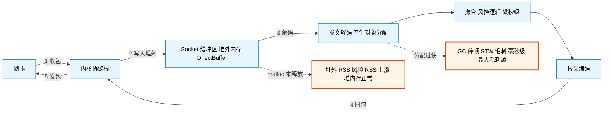
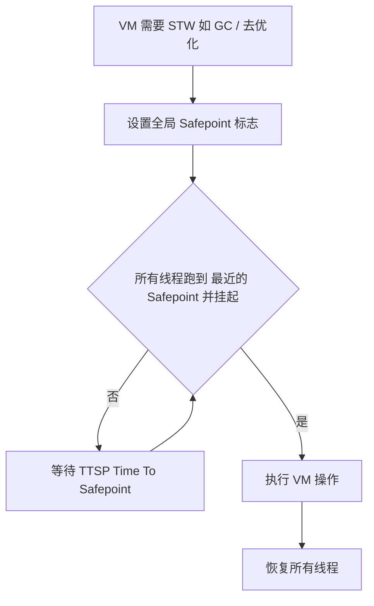
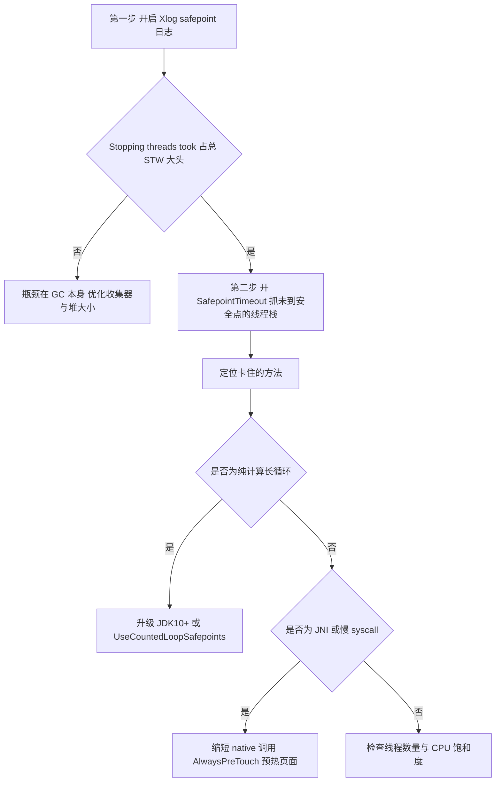
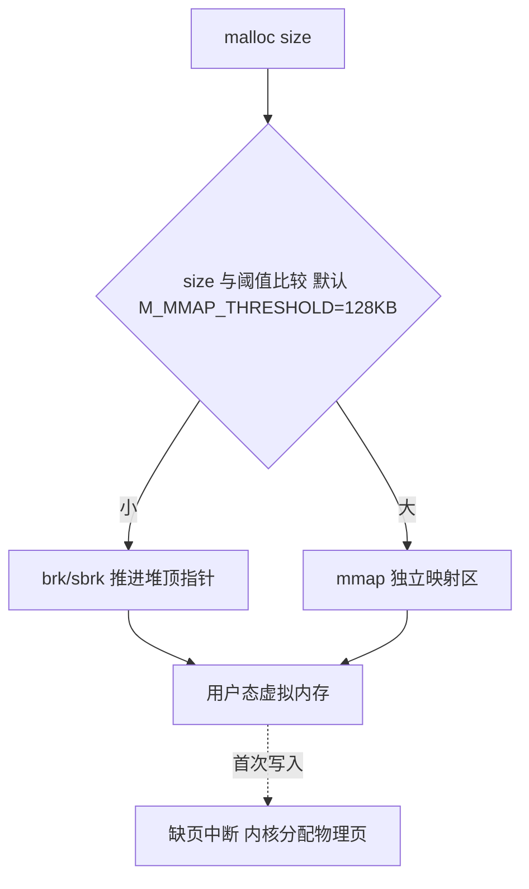
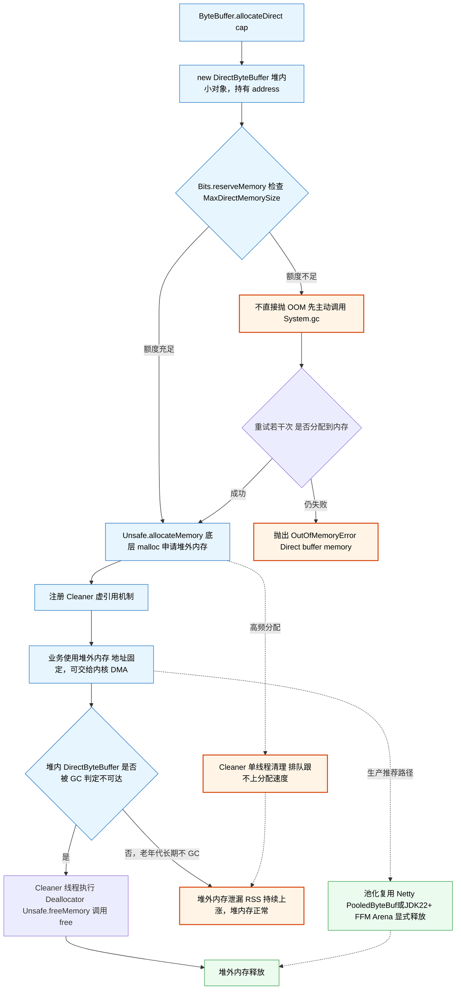

# JVM 低延迟与 IO 深度解析

> 主题：Java 金融低延迟 —— STW / malloc / 堆外内存 DirectByteBuffer / 零拷贝 / 低 GC 优化
> 适用：JDK 8 ~ JDK 24（涉及版本差异处已标注）
> 定位：从「背概念」到「能讲清底层路径 + 能定位毛刺 + 能扛追问」

---

## 1. 全景：一次交易请求的延迟预算

低延迟优化的前提是**知道时间花在哪**。以下是同机房一次网络请求往返的典型量级（仅供参考，务必在自己的环境实测）：

| 环节 | 典型耗时 | 说明 |
| --- | --- | --- |
| 同机房网络 RTT | 10 ~ 100 μs | 万兆交换机 ~10-50 μs，跨机柜更长 |
| 内核协议栈收发 | 10 ~ 50 μs | 可被内核旁路（Onload / VMA / DPDK）绕过 |
| 上下文切换 | 1 ~ 5 μs | park/unpark、syscall 进出 |
| **G1 / Parallel GC STW** | **10 ms ~ 数秒** | ⚠️ 最大的毛刺源，比业务处理慢千倍 |
| **ZGC STW** | **< 1 ms（典型亚毫秒）** | 与堆大小无关 |
| 主线程 major page fault | 数百 μs ~ ms | 首次访问未映射内存触发，必须预热 |
| 缓存未命中 | L3 ~40 ns / 主存 ~100 ns | 伪共享会让这个代价反复出现 |
| CAS 成功（无竞争） | ~10 ~ 20 ns | 无锁队列的基础 |

**结论先行：**
> 业务代码通常只占几微秒，而一次 STW 可以是它的**上千倍**。所以低延迟优化的第一优先级是**消除 GC 毛刺**，而不是优化业务算法。



---

## 2. STW：不只是 GC

### 2.1 定义与本质

`STW(Stop-The-World)`：JVM 暂停**全部 Java 业务线程**，只运行 VM/GC 线程。

> **优化目标不是消除 STW，而是降低频率 + 缩短单次时长。** 所有生产级收集器都有 STW 阶段，区别只在时长与是否随堆增大而变长。

### 2.2 真正的机制：Safepoint（安全点）

**线程并不是在任意位置都能被暂停的**——必须在「安全点」。安全点是代码中的特定位置（方法返回前、循环回边、异常抛出点等），此时线程的**栈与堆引用关系是一致、可枚举的**，JVM 才能安全扫描。



**关键洞察：一次 STW 的总时长 = TTSP（进入耗时）+ VM 操作耗时。**
很多「GC 停顿 200ms」的 case，GC 本身只用了 5ms，剩下 195ms 都在**等某个线程走到安全点**。

**所有会触发 Safepoint 的操作（不止是 GC）**：

| 类别 | 具体操作 |
| --- | --- |
| GC | Young GC、Full GC、ZGC/Shenandoah 的初始标记/再标记/转移根等短暂停 |
| JIT 相关 | **去优化（Deoptimization）**、ICBufferFull、代码缓存满导致的清理 |
| 锁相关 | 偏向锁撤销（JDK 15 起已废弃偏向锁）、Monitor deflation |
| 诊断 | `jstack` / `jmap -histo` / Heap Dump / `jcmd` 部分命令 |
| 类与反射 | 类重定义（instrumentation）、类卸载 |
| 其他 | Thread dump、部分 JFR 检查点、<br/>VM 周期性清理（`GuaranteedSafepointInterval`，默认 1000 ms） |

> 💡 这意味着：**线上随手 `jstack` 一次，也可能给交易线程带来毫秒级毛刺**。低延迟系统的诊断要格外克制，优先用 JFR（异步、低开销）。

### 2.3 TTSP 经典坑：计次循环没有 Safepoint

JIT 为了性能，会**消除计次循环（counted loop）内部的 safepoint 检查指令**。如果业务里有一个跑很久的 `for (int i...)` 大循环，其他线程都在等它走到安全点 → TTSP 爆炸。

```java
// JDK 8 上可能「卡住」整个 JVM 的写法
for (int i = 0; i < 2_000_000_000; i++) {
    hash += data[i % len];   // 循环体内无方法调用、无内存写屏障
}
// 现象：GC 日志里 "Reaching safepoint" / sync time 长达几百毫秒甚至秒级
```

**版本差异（重要）**：

| JDK | 行为 |
| --- | --- |
| JDK 8 | `-XX:+UseCountedLoopSafepoints` **默认 false**，计次循环无 safepoint 检查 |
| JDK 10+ | 引入 **Loop Strip Mining**：把大循环拆成「外层带 safepoint 检查 + 内层全速跑」，`UseCountedLoopSafepoints` 默认值**取决于所选 GC 是否需要低延迟安全点**（ZGC/G1 等低延迟 GC 为 true，Serial/Parallel 为 false） |

相关参数：`-XX:LoopStripMiningIter=1000`（内层循环迭代数上限，默认 1000）、`-XX:GuaranteedSafepointInterval=1000`（周期性安全点间隔）。

**排查与验证：**

```bash
# JDK 8
-XX:+UnlockDiagnosticVMOptions -XX:+PrintSafepointStatistics \
-XX:PrintSafepointStatisticsCount=1

# JDK 9+（推荐）
-Xlog:safepoint*:file=safepoint.log:time,uptime:filecount=5,filesize=20m
```

日志里重点看两列：**`Reaching safepoint`（TTSP）** 与 **`At safepoint`（实际 VM 操作）**。前者大 → 查长循环；后者大 → 查 GC / 去优化。

### 2.4 TTSP 排查实战：三层递进法

排查口诀：**量化 → 抓现场 → 归因**。三层缺一不可，跳过第一层很容易把 195ms 的等待当成 5ms 的 GC 去优化。

#### 第一层：量化 —— TTSP 到底占多少

**JDK 9+（推荐，统一日志）：**

```bash
-Xlog:safepoint*:file=safepoint.log:time,uptime:filecount=5,filesize=20m
```

典型输出：

```
[info][safepoint] Entering safepoint region: G1IncCollectionPause
[info][safepoint] Total time for which application threads were stopped: 0.2013456 seconds,
                  Stopping threads took: 0.1952000 seconds
```

| 字段                     | 含义                         | 本例   |
| ------------------------ | ---------------------------- | ------ |
| `Total time ... stopped` | **总 STW**                   | 201 ms |
| `Stopping threads took`  | **TTSP**（等线程走到安全点） | 195 ms |
| 两者相减                 | **VM 操作耗时**（真实工作）  | 6 ms   |

> **判定标准**：`Stopping threads took` 占总 STW 的**大头**（> 50%）→ 瓶颈在 TTSP，**换 GC 算法毫无意义**，直接进入第二层。

**JDK 8：**

```bash
-XX:+UnlockDiagnosticVMOptions \
-XX:+PrintSafepointStatistics \
-XX:PrintSafepointStatisticsCount=1
```

输出为表格，重点看 `sync` 与 `vmop` 两列：

```
vmop                  [threads: total initially_running wait_to_block]  [time: spin block sync cleanup vmop]
G1IncCollectionPause  [   200        0              1            ]      [     0   195  195       0     6   ]
```

- `sync`（= spin + block）= **TTSP**
- `vmop` = VM 操作真实耗时

#### 第二层：抓现场 —— 是谁没走到安全点

这是最关键的一步。JVM 提供专门参数，在 TTSP 超阈值时**直接把没到安全点的线程栈打印出来**：

```bash
-XX:+UnlockDiagnosticVMOptions \
-XX:+SafepointTimeout \
-XX:SafepointTimeoutDelay=500        # 单位 ms，TTSP 超过该值就报警
```

超时时 stderr 输出：

```
# SafepointSynchronize::begin: Timeout detected:
# SafepointSynchronize::begin: Timed out while waiting for threads to stop.
# SafepointSynchronize::begin: Threads which did not reach the safepoint:
# "business-worker-3" #27 prio=5 tid=0x00007f... nid=0x4a2b runnable
   java.lang.Thread.State: RUNNABLE
        at com.xxx.MatchingEngine.score(MatchingEngine.java:142)   ← 卡在这一行
# SafepointSynchronize::begin: (End of list)
```

**看到这个栈，定位就完成了一半。**

> ⚠️ 该参数是 diagnostic 级别，但**平时几乎零开销**（仅在超时时才打栈），低延迟系统建议**常态保留**，阈值设 200 ~ 500 ms。

#### 第三层：归因 —— 为什么它到不了安全点

拿到线程栈后对照下表判断：

| 栈的特征                                        | 根因                                                       | 解法                                  |
| ----------------------------------------------- | ---------------------------------------------------------- | ------------------------------------- |
| 停在**纯计算的长 `for` 循环**，循环体无方法调用 | JIT 消除了计次循环内的 safepoint 检查                      | 见下方「三大解法」                    |
| 停在 **JNI 方法** / native 调用                 | native 代码**不检查** safepoint 标志，须等返回 Java 才响应 | 缩短 JNI 调用；排查慢 syscall         |
| 停在内存分配 / 首次访问新内存                   | **major page fault**（毫秒级）                             | `-XX:+AlwaysPreTouch` 预热；检查 mmap |
| 停在文件 IO / 网络 IO                           | 慢系统调用，syscall 返回后才检查 safepoint                 | 异步 IO；移出核心链路                 |
| 线程数极多（数千上万）                          | 光是通知 + 轮询所有线程就慢                                | 减少线程数；JDK 21+ 虚拟线程          |
| 栈正常但 `initially_running` 很大               | CPU 饱和，线程调度不开                                     | 降负载、CPU 绑核隔离                  |

#### 计次循环问题的三大解法（按优先级）

**① 升级到 JDK 10+（根治）**

JDK 10 的 **Loop Strip Mining** 把大循环拆成两层，从机制上解决：

```java
// JIT 实际改写为
for (int p = start; p < end; p += 1000) {
    for (int q = 0; q < 1000; q++) { /* 内层全速，无检查 */ }
    safepoint_poll();          // 外层每 1000 次检查一次
}
```

**② JDK 8 上补参数**

```bash
-XX:+UseCountedLoopSafepoints     # JDK 8 默认 false
```

**③ 代码层面**（无法升级时的临时手段，在长循环体内人为制造安全点）

```java
for (int i = 0; i < huge; i++) {
    compute(data[i]);
    if ((i & 0x3FF) == 0) Thread.yield();   // 每 1024 次让出一次
}
```

#### 排查流程图



#### 补充手段：JFR 持续采样 + 主动复现

```bash
# JFR 生产常开（开销通常 < 1%），可回溯历史上每一次 STW 的构成
-XX:StartFlightRecording=settings=profile,filename=app.jfr
# 关注事件：jdk.SafepointBegin / jdk.SafepointEnd / jdk.ExecuteVMOperation
```

想验证是否为 counted loop 问题，可用下面这段代码在 **JDK 8** 上复现：

```java
public class TtspDemo {
    static volatile long sink;
    static volatile boolean running = false;

    // 三个关键点：
    // 1) 必须是 int 计数器 —— JDK 8 上 long 计数器不算 counted loop，反而自带 safepoint
    // 2) 循环体内不能有任何方法调用 —— 调用会带 safepoint poll
    // 3) 制造依赖链，让总耗时远大于 1000ms（否则循环先跑完，复现不出来）
    static long busyLoop(int iterations) {
        long h = 0;
        for (int i = 0; i < iterations; i++) {
            h += i * 31L + (h >>> 7);   // 依赖链 ~4 cycle/iter
        }
        return h;
    }

    public static void main(String[] args) throws Exception {
        // 第一步：预热，确保被 C2 编译（解释执行时是有 safepoint 的！）
        for (int k = 0; k < 30; k++) sink = busyLoop(200_000);
        System.out.println("JIT 预热完成");

        Thread busy = new Thread(() -> {
            running = true;
            sink = busyLoop(Integer.MAX_VALUE);   // 21 亿次 × 4 cycle ≈ 3 秒
            running = false;
        }, "busy-loop");
        busy.start();

        Thread.sleep(300);
        System.out.println("busy 已启动，running=" + running);

        // 第二步：显式触发 GC，在确定时刻强制发起 safepoint，不靠 1000ms 周期撞运气
        new Thread(() -> {
            try { Thread.sleep(1100); } catch (InterruptedException ignored) {}
            System.gc();
        }, "gc-trigger").start();

        long t0 = System.currentTimeMillis();
        Thread.sleep(1000);
        long cost = System.currentTimeMillis() - t0;

        System.out.println("sleep(1000) 实际耗时 = " + cost + "ms");
        System.out.println("此时 busy 仍在运行? " + running);
    }
}

```

JDK 8 上输出会**远超 1000ms**——`sleep` 返回后发现 VM 正在等安全点，只能干等长循环跑完；加上 `-XX:+UseCountedLoopSafepoints` 即恢复正常。

### 2.5 收集器 STW 横向对比

| 收集器            | STW 特点                                                     | 适用                       |
| ----------------- | ------------------------------------------------------------ | -------------------------- |
| Serial / Parallel | 全程 STW，时长随堆线性增长                                   | 批处理、离线任务           |
| G1（JDK 9+ 默认） | 分 Region 回收，可设 `-XX:MaxGCPauseMillis=N`（目标，非保证），典型 10~100 ms | 通用服务端                 |
| **ZGC**           | **暂停 < 1 ms，且时长与堆大小无关**（支持几百 MB ~ 多 TB）   | **金融低延迟首选**         |
| Shenandoah        | 低暂停，类似 ZGC， Brooks/加载屏障方案                       | 低延迟备选                 |
| Epsilon           | 完全不回收（只分配）                                         | 压测基线、极短生命周期任务 |

**ZGC 版本演进**：JDK 11 实验性引入（JEP 333）→ JDK 15 生产可用（JEP 377）→ JDK 21 支持分代（JEP 439，`-XX:+ZGenerational`）→ **JDK 23 分代 ZGC 成为默认**（JEP 474）→ JDK 24 移除非分代模式（JEP 490）。

> **分代 ZGC 的价值**（JEP 439 目标）：显著降低 **Allocation Stall**（分配速率超过回收速率导致的线程停顿）风险、降低堆内存开销与 GC CPU 开销，同时**保持暂停时间不超过 1 ms** 。如果还在 JDK 17 用非分代 ZGC 并遇到 Allocation Stall，升级到 JDK 21+ 分代模式是首选方案 。

### 2.6 观测手段

```bash
# GC 日志（JDK 9+ 统一日志）
-Xlog:gc*:file=gc.log:time,uptime,level,tags:filecount=10,filesize=50m

# 实时观察
jstat -gcutil <pid> 1000
jcmd <pid> VM.native_memory summary        # 需先开 -XX:NativeMemoryTracking=summary

# JFR（低开销，生产可常开，开销通常 < 1%）
-XX:StartFlightRecording=duration=0s,filename=app.jfr
```

---

## 3. malloc：堆外内存的真正入口

### 3.1 定义与两条系统调用路径

`malloc()` 是 C 标准库的内存分配函数（memory allocate），向操作系统申请**用户态堆外（native）内存**，不属于 JVM 堆。
`ByteBuffer.allocateDirect()` 底层 native 方法最终调用 `Unsafe.allocateMemory()` → `malloc`。



### 3.2 核心特性

1. **不受 GC 直接管理**：不会因 YGC/FGC 被扫描或移动；
2. **需要显式 `free()`**（或靠 DirectByteBuffer 的 Cleaner 间接释放），否则**堆外内存泄漏**：进程 RSS 持续上涨，而 JVM 堆内存显示正常；
3. **访问成本高于堆内引用**：需边界检查 + 地址转换，频繁小字段读写反而更慢。

> `DirectByteBuffer` 是一个**堆内的 Java 小对象**，它持有堆外地址；当这个堆内对象被 GC 回收时，会触发 **Cleaner** 释放堆外内存。
> 所以准确说法是：**堆外内存不被 GC 扫描/移动，但它的释放「间接依赖」堆内对象的 GC。** 详见第 4.2 节。

### 3.3 malloc 也是延迟毛刺源

这是金融低延迟实践中极重要的一块：

| 风险 | 说明 |
| --- | --- |
| **arena 锁竞争** | glibc ptmalloc 为每个线程分配 arena（64 位系统默认 arena 数 ≈ 8 × CPU 核数），高并发分配时争抢 arena 锁 |
| **RSS 不归还** | `free()` 只把内存还给 ptmalloc 的 bin/fastbin，**不保证归还操作系统**；top chunk 需超过 trim 阈值才 `M_TRIM`。表现为「RSS 涨上去就下不来」 |
| **内存碎片放大** | 多 arena 各自持有空闲块，外表 RSS 很高但实际用量不大 |
| **缺页中断** | 首次写入新分配的页触发 minor/major fault，major fault 可达毫秒级 |
| **系统调用开销** | 超过阈值走 `mmap`，陷入内核，比用户态分配贵一个量级 |

### 3.4 低延迟实践：替换 glibc malloc

金融级 Java 系统常见做法是用 **jemalloc / tcmalloc** 替换 glibc 的 ptmalloc：

```bash
# 方式一：LD_PRELOAD（最常用）
export LD_PRELOAD=/usr/lib/x86_64-linux-gnu/libjemalloc.so
export MALLOC_CONF="background_thread:true,metadata_thp:auto,dirty_decay_ms:30000,muzzy_decay_ms:30000"

# 方式二：链接时指定
# 编译时 -ljemalloc
```

**jemalloc 的优势**：更低的锁竞争（细粒度 arena + tcache）、更可控的内存归还（`dirty_decay_ms` 控制脏页回收节奏）、自带碎片分析（`malloc_stats_print`）。

> 如果暂时不能换 malloc，至少可以限制 glibc 的 arena 数量：
> ```bash
> export MALLOC_ARENA_MAX=2    # 默认可能是 CPU 核数 × 8，是 RSS 膨胀的主因之一
> ```

### 3.5 观测：定位 native 内存去向

```bash
# 1) NMT：区分「JVM 堆 / 元空间 / 线程 / 代码缓存 / GC / Other」
-XX:NativeMemoryTracking=summary     # 启动参数（有 5~10% 性能开销，压测时关闭）
jcmd <pid> VM.native_memory summary scale=MB
jcmd <pid> VM.native_memory detail.diff      # 做两次 baseline 对比，最有效

# 2) 堆外缓冲区用量（BufferPoolMXBean）
# 3) 系统层：pmap -x <pid> | sort -k2 -n | tail ; cat /proc/<pid>/status | grep Rss
```

> NMT 里 **`Other` 一栏暴涨** 通常就指向 `malloc` 分配（DirectByteBuffer、压缩库、JNI 库等）。

---

## 4. 堆外内存 DirectByteBuffer

### 4.1 堆内 vs 堆外：真实的取舍

| 维度 | 堆内 `byte[]` / HeapByteBuffer | 堆外 DirectByteBuffer |
| --- | --- | --- |
| 分配速度 | **极快**（TLAB 上指针碰撞，几乎零成本） | 慢（malloc + 系统调用 + 内存清零） |
| 访问速度 | 快（直接引用，JIT 可优化） | 略慢（边界检查 + 地址转换，`Unsafe` 可接近堆内） |
| GC 影响 | 大量大数组 → 扫描/复制成本高，触发 STW | **不占堆、不被扫描移动**，降低 GC 压力 |
| 回收 | 自动、确定 | 依赖 Cleaner，**时机不确定** |
| 零拷贝 | ❌ 系统调用时会被 GC 移动 → 需额外拷贝 | ✅ 地址固定，可直接交给内核 |
| 共享 | 不便于跨进程/跨 JNI | 可跨进程共享、可被 DMA 直接使用 |

> **核心结论：堆外的核心价值是「把 GC 压力从堆里挪走」和「支持零拷贝」，而不是「访问更快」。**
> **小报文（几 KB 以内）用堆内 `byte[]` 往往更快；只有大块、高频、长生命周期或要走 IO 的数据才值得放堆外**。

### 4.2 分配与回收链路（含 Cleaner 机制）



**JDK 版本差异**：

| JDK | Cleaner 实现 |
| --- | --- |
| JDK 8 | `sun.misc.Cleaner`（`PhantomReference` 子类），由 **ReferenceHandler 线程** 串行处理 |
| JDK 9+ | 迁移到 `jdk.internal.ref.Cleaner` / 独立 Cleaner 线程，避免与业务抢占 ReferenceHandler |

> **隐患**：ReferenceHandler / Cleaner 是**单线程**处理队列的。如果大量 DirectByteBuffer 同时变成垃圾，清理会排队，**释放速度跟不上分配速度** → 即使没有泄漏也可能 OOM。这是「频繁创建 DirectByteBuffer」必须被禁止的根本原因，也是 Netty **池化**存在的意义。

### 4.3 🔴 致命坑：分配失败会触发 `System.gc()`

看 JDK 源码 `java.nio.Bits.reserveMemory()`：当已分配的堆外内存达到上限时，JVM **不会直接抛 OOM，而是先尝试清理 + 主动调用 `System.gc()`**，试图回收堆内那些不可达的 DirectByteBuffer 对象，然后再重试；多次失败后才抛 `OutOfMemoryError("Direct buffer memory")` 。

```java
// java.nio.Bits（简化代码）
static void reserveMemory(long size, int cap) {
    if (!memoryLimitSet && VM.initLevel() >= 1) {
        MAX_MEMORY = VM.maxDirectMemory();
        memoryLimitSet = true;
    }
    if (tryReserveMemory(size, cap)) return;      // 乐观分配
    // ... 空间不足：尝试清理
    System.gc();                                  // ⚠️ 显式触发 Full GC！
    // ... sleep 后重试若干次
    throw new OutOfMemoryError("Direct buffer memory");
}
```

**后果**：在低延迟系统中，这个 `System.gc()` 可能带来**几十毫秒到秒级的停顿**——而你以为自己已经在用堆外内存「避免 GC」了。

**对策**：

| 对策 | 说明 |
| --- | --- |
| **池化复用** | 用 Netty `PooledByteBufAllocator`，杜绝频繁 allocate（首选） |
| **显式设置上限** | `-XX:MaxDirectMemorySize` 给足容量，避免走到 reserveMemory 的 GC 分支 |
| **配合并发 GC** | 若加了 `-XX:+DisableExplicitGC` 使 `System.gc()` 失效，堆外分配失败会**直接 OOM**。此时应改为 `-XX:+ExplicitGCInvokesConcurrent`（让显式 GC 走并发回收，避免 Full GC 长停） |
| **显式释放** | 见 4.5 节，不依赖 Cleaner |

### 4.4 `MaxDirectMemorySize` 与 OOM

- **默认值 = `Runtime.getRuntime().maxMemory()`**，即约等于 `-Xmx`（精确说是堆最大容量，含 survivor 计算差异）；
  - 源码路径：未显式设置时 `sun.nio.MaxDirectMemorySize` 属性为 `-1` → `VM.saveAndRemoveProperties` 把 `directMemory` 设为 `Runtime.maxMemory()` ；
  - JDK 7 及更早是硬编码 **64 MB**，JDK 8u20 之后改为跟随 `-Xmx` ；
- ⚠️ **危险推论**：`-Xmx4g` 且未设置 `MaxDirectMemorySize` 时，堆 + 堆外理论可吃满约 **8 GB**。在容器里这极易触发 **OOMKilled（exit 137）**，因为 JVM 只按 `-Xmx` 感知内存限制 。

```bash
# 容器/低延迟环境务必显式设置，并预留 native 空间
-Xmx4g -XX:MaxDirectMemorySize=1g
# 或用百分比控制堆，给堆外留余量
-XX:MaxRAMPercentage=70 -XX:MaxDirectMemorySize=1g
```

### 4.5 泄漏排查与显式释放

**典型泄漏场景**：
1. 频繁 `allocateDirect()` 而不释放（Cleaner 线程跟不上）；
2. DirectByteBuffer 对象被**长生命周期引用**（静态缓存、老年代对象）持有，永不 GC → 堆外永不释放；
3. 用了 `-XX:+DisableExplicitGC`，Old 区长期不回收 ；
4. JNI / 第三方 native 库（压缩、加密、图像处理）自己 malloc 未 free。

**排查工具链**：

```bash
# 1. 看堆外用量（生产友好）
jcmd <pid> VM.native_memory summary scale=MB      # 看 Other 是否持续涨
# 2. 看 BufferPool
jcmd <pid> VM.system_properties | grep nio
# 代码方式：BufferPoolMXBean（name="direct"）取 getMemoryUsed()
# 3. 抓分配现场
-XX:MaxDirectMemorySize=1g -XX:+HeapDumpOnOutOfMemoryError
# 用 JFR 的 jdk.DirectBufferStatistics 事件持续采样（低开销，推荐）
```

**显式释放（不依赖 Cleaner）**：

```java
import java.lang.reflect.Method;
import java.nio.ByteBuffer;

public final class DirectBufferFree {
    private DirectBufferFree() {}

    public static void free(ByteBuffer buffer) {
        if (buffer == null || !buffer.isDirect()) return;
        try {
            // JDK 9+：Unsafe.invokeCleaner（内部 API，高版本需 --add-exports 或反射）
            Class<?> unsafeCls = Class.forName("sun.misc.Unsafe");
            java.lang.reflect.Field f = unsafeCls.getDeclaredField("theUnsafe");
            f.setAccessible(true);
            Object unsafe = f.get(null);
            Method m = unsafeCls.getMethod("invokeCleaner", ByteBuffer.class);
            m.invoke(unsafe, buffer);
        } catch (Exception e) {
            // 降级：交给 Cleaner 兜底
            throw new IllegalStateException("释放堆外内存失败", e);
        }
    }
}
```

> **生产推荐**：直接使用 **Netty** 的 `PlatformDependent.freeDirectBuffer(ByteBuffer)` 或 `ReferenceCountUtil.release(byteBuf)`，它已封装各 JDK 版本的差异。
> ⚠️ `invokeCleaner` 属于内部 API，在受强封装（JDK 16+ `--illegal-access=deny`）或更高版本中可能失效。**长期方案应迁移到 JDK 22+ 的 FFM `Arena`（见 4.6）**，或彻底依赖 Netty 池化。

### 4.6 JDK 22+ 现代方案：FFM（MemorySegment + Arena）

JDK 22（JEP 454）起，**Foreign Function & Memory API 正式转正**，这是管理堆外内存的**官方推荐方式**——`Arena` 提供确定性的作用域释放，彻底摆脱 Cleaner 的不确定性（JDK 21 为预览，需 `--enable-preview`）。

```java
import java.lang.foreign.Arena;
import java.lang.foreign.MemorySegment;
import java.lang.foreign.ValueLayout;

// 作用域结束（try-with-resources）即确定性释放，无需 Cleaner、无 GC 参与
try (Arena arena = Arena.ofConfined()) {
    MemorySegment segment = arena.allocate(1024);   // 堆外 1024 字节
    segment.setAtIndex(ValueLayout.JAVA_BYTE, 0, (byte) 0x01);
    byte b = segment.getAtIndex(ValueLayout.JAVA_BYTE, 0);
    System.out.println(b);
}   // ← 此处内存立即释放，时机确定，不会泄漏
```

`Arena` 三种类型：
- `ofConfined()`：单线程，最快；
- `ofShared()`：多线程共享；
- `ofAuto()`：交给 GC 管理（类似 Cleaner，用于渐进迁移）。

### 4.7 Netty 实战要点

| 要点 | 配置/做法 |
| --- | --- |
| 用池化分配器 | `PooledByteBufAllocator.DEFAULT`（Netty 默认已开启） |
| 严格引用计数 | `ReferenceCountUtil.release(msg)` / `safeRelease`，`try-finally` 中释放 |
| 泄漏检测 | `-Dio.netty.leakDetection.level=advanced`（压测用 `paranoid`，生产 `simple`/`disabled`） |
| 堆外上限 | `-Dio.netty.maxDirectMemory=0`（表示沿用 JVM 的 `MaxDirectMemorySize`）；或用 Netty 自己的上限 |
| arena 数量 | `-Dio.netty.allocator.numDirectArenas`（通常设为 CPU 核数，减少竞争与碎片） |
| 诊断增强 | `-Dio.netty.noJdkZlibDecompressor` 等按场景；`-Dio.netty.tryReflectionSetAccessible=true`（旧版 JDK） |

### 4.8 代码示例（demo）

```java
import java.nio.ByteBuffer;

public class DirectBufferDemo {
    public static void main(String[] args) {
        // 1. 分配 100 字节堆外内存（底层 malloc）
        ByteBuffer directBuf = ByteBuffer.allocateDirect(100);

        // 2. 写入：position 前进
        directBuf.put((byte) 0x01);
        directBuf.put((byte) 0x02);

        // 3. 切换为读模式：limit=position, position=0
        directBuf.flip();

        while (directBuf.hasRemaining()) {
            byte b = directBuf.get();
            System.out.print(b + " ");   // 输出：1 2
        }
        System.out.println("\ncapacity=" + directBuf.capacity());

        // 4. 生产环境必须显式释放（Netty: ReferenceCountUtil.release / PlatformDependent.freeDirectBuffer）
        //    demo 中依赖 Cleaner 后台回收 —— 但切勿在生产依赖它
    }
}
```

---

## 5. 零拷贝 Zero-Copy

### 5.1 先说清楚：零拷贝到底是什么

> **零拷贝不是「拷贝次数为 0」，而是「消除 CPU 参与的数据搬运」**——把 CPU 从「搬运工」变成「只传描述符」，数据搬运交给 DMA 控制器。

**关键区分：CPU 拷贝 vs DMA 拷贝。** DMA 拷贝不占用 CPU 周期，可与计算并行，成本低；CPU 拷贝则要占用核心、占用内存带宽、污染 cache。

### 5.2 传统 IO 到底拷贝了几次

**场景：从磁盘文件读出，通过 socket 发出去（`read` + `write`）。**

```mermaid
graph TD
    subgraph T1["① 传统 read + write：4 次拷贝 / 4 次上下文切换"]
        A1["磁盘"] -->|"① DMA 拷贝"| B1["内核 Read Buffer"]
        B1 -->|"② CPU 拷贝<br/>切入用户态"| C1["用户空间 buffer"]
        C1 -->|"③ CPU 拷贝<br/>再切回内核态"| D1["内核 Socket Buffer"]
        D1 -->|"④ DMA 拷贝"| E1["网卡"]
    end

    subgraph T2["② sendfile：3 次拷贝 / 2 次上下文切换"]
        A2["磁盘"] -->|"① DMA 拷贝"| B2["内核 Read Buffer"]
        B2 -->|"② CPU 拷贝<br/>拷贝的是真实数据"| D2["内核 Socket Buffer<br/>全程内核态，数据不进用户空间"]
        D2 -->|"③ DMA 拷贝"| E2["网卡"]
    end

    subgraph T3["③ sendfile + SG-DMA：2 次拷贝 / 0 次 CPU 拷贝"]
        A3["磁盘"] -->|"① DMA 拷贝"| B3["内核 Read Buffer"]
        B3 -->|"② 仅传描述符<br/>网卡按描述符 gather 直读"| E3["网卡 全程内核态"]
    end

    classDef dev fill:#868e96,stroke:#495057,color:#fff
    classDef kernel fill:#e7f5ff,stroke:#1971c2,color:#000
    classDef user fill:#fff9db,stroke:#f08c00,stroke-width:2px,color:#000
    class A1,E1,A2,E2,A3,E3 dev
    class B1,D1,B2,D2,B3 kernel
    class C1 user
```



| 方式 | DMA 拷贝 | CPU 拷贝 | 上下文切换 | 数据经过用户空间 |
| --- | --- | --- | --- | --- |
| 传统 `read`+`write` | 2 | **2** | 4 | ✅ 是 |
| `mmap` + `write` | 2 | **1** | 4（+缺页中断） | ✅ 是（映射，不复制） |
| `sendfile` | 2 | **1**（仅拷贝描述符到 socket buffer） | **2** | ❌ 否 |
| `sendfile` + SG-DMA（Linux 2.4+） | 2 | **0** | **2** | ❌ 否 |
| `splice`（Linux 2.6.17+） | 2 | **0** | 2 | ❌ 否（经 pipe buffer） |

### 5.3 🔴 Java 特有的额外一次拷贝

**这是「为什么 Java 零拷贝必须用 DirectByteBuffer」的真正原因**：

JVM 的 GC 会**移动堆内对象**。操作系统执行 `read(fd, buf, len)` 这类系统调用时，要求 `buf` 指向的**内存地址在整个系统调用期间不能被改变**——否则 DMA 可能写到已被挪走的地址。

因此，用 **HeapByteBuffer（堆内）** 做 IO 时，JVM 必须：
1. 先临时分配一块 **DirectByteBuffer**；
2. 把堆内数据拷贝到这块堆外内存；
3. 用堆外内存地址发起系统调用；
4. 完成后再把数据拷回堆内（读场景）。

> **结论：Java 用堆内 `byte[]` 做 IO，比 C 语言的传统 read+write 还要多一次拷贝（堆内 ↔ 堆外临时缓冲）。**
> 使用 `DirectByteBuffer` 就直接省掉这一次，同时避免了临时 DirectBuffer 的分配与线程本地缓存污染。

### 5.4 Java 层的三个入口

| Java API | 底层 | 说明 |
| --- | --- | --- |
| `FileChannel.transferTo/transferFrom` | **`sendfile`** | 文件 → socket 的经典零拷贝；数据不进用户空间，**无法修改数据** |
| `MappedByteBuffer`（`FileChannel.map`） | **`mmap`** | 文件映射为内存，可随机读写；仍比 sendfile 多一次 CPU 拷贝 |
| `SocketChannel.write(DirectByteBuffer)` | 普通 `write` | 用堆外内存避免了第 5.3 节的那次额外拷贝，但**不是** OS 零拷贝 |

```java
// 1) sendfile：文件 → socket，零 CPU 拷贝
try (FileChannel src = FileChannel.open(Path.of("data.bin"), StandardOpenOption.READ);
     SocketChannel sock = SocketChannel.open(new InetSocketAddress(host, port))) {
    long pos = 0, total = src.size();
    while (pos < total) {
        // ⚠️ Linux 单次 transferTo 有长度上限（常见 2GB），且可能未传完，必须循环
        long n = src.transferTo(pos, total - pos, sock);
        if (n <= 0) break;
        pos += n;
    }
}

// 2) mmap：随机读写大文件
try (FileChannel ch = FileChannel.open(Path.of("commitlog"), READ, WRITE)) {
    MappedByteBuffer mapped = ch.map(FileChannel.MapMode.READ_WRITE, 0, 1 << 20);
    mapped.putInt(0, 42);      // 直接写内存即写文件（由 OS 刷盘）
    mapped.force();            // 强制刷盘
}
```

### 5.5 Netty 的「零拷贝」是另一回事（重要区分）

Netty 文档里的 zero-copy 指**用户空间零拷贝**（避免应用层 buffer 复制），与 OS 的零拷贝**不是同一个概念**此处极易混淆：

| Netty 机制 | 作用 |
| --- | --- |
| `CompositeByteBuf` | 把多个 ByteBuf **逻辑组合**成一个，避免合并时的内存复制 |
| `slice()` / `duplicate()` | 共享同一块内存的不同视图，零复制拆分 |
| `Unpooled.wrappedBuffer(...)` | 包装已有 `byte[]`/ByteBuf，避免拷贝 |
| **`DefaultFileRegion`** | 用 `transferTo` 发送文件 —— 这个**才是真正的 OS 层零拷贝** |

> 所以：Netty 既支持「应用层零拷贝」（CompositeByteBuf），也支持「OS 层零拷贝」（FileRegion / transferTo）。

### 5.6 中间件怎么选（经典对照）

| 中间件 | 采用方案 | 原因 |
| --- | --- | --- |
| **Kafka** | `transferTo`（sendfile）+ `mmap`（索引文件） | 消费端多是「文件 → 网络」的整块传输，不需要改数据，sendfile 最省 |
| **RocketMQ** | `MappedByteBuffer`（mmap） | CommitLog 需要随机读写、按位点查询，mmap 可当数组用；牺牲一次 CPU 拷贝换灵活性 |

> 一句话记忆：**整块转发用 sendfile，随机读写用 mmap。**

### 5.7 常见误区澄清

| 误区 | 正解 |
| --- | --- |
| 「用了 DirectByteBuffer 就是零拷贝」 | ❌ 只是**避免**了 Java 层的额外拷贝；真正的零 CPU 拷贝需要 `sendfile`/`splice` |
| 「零拷贝完全没有拷贝」 | ❌ 至少还有 2 次 DMA 拷贝；零的是 **CPU** 拷贝 |
| 「sendfile 能改数据再发」 | ❌ 数据不经过用户空间，无法修改；要改就用 mmap |
| 「transferTo 一次就能传完」 | ❌ 可能只传部分，必须循环；Linux 单次上限通常 2GB |
| 「零拷贝一定更快」 | ❌ 小文件/小报文时 syscall 与上下文切换占主导，收益有限；大块传输才显著 |

---

## 6. 低 GC 优化：完整体系

> **低 GC = 编码规范 + JVM 参数 + OS 调优 + 预热 + 度量，五者缺一不可。**

### 6.1 🔴 先纠偏：对象池不是万能药

「对象池复用对象，减少频繁 new 短命临时对象」——**这条要加重要限定条件**：

现代 JVM 上，**短命小对象的分配成本极低**（TLAB 上指针碰撞，仅几条指令），而 YGC 回收「已死对象」的成本**接近零**（只拷贝存活对象，死对象不扫描）。

**盲目池化的危害**：

1. 池化对象**必然长期存活 → 晋升老年代**，反而加重 Major GC 与标记成本；
2. 引入并发管理开销（锁 / CAS / 引用计数），可能比直接 new 更慢；
3. 归还/借用逻辑出错会导致对象状态污染、泄漏；
4. 增大存活对象集，让 GC 根扫描变慢。

**对象池的正确适用范围（四象限）**：

|  | **小对象**（几十 B） | **大对象 / 重资源**（KB 级以上、连接、线程） |
| --- | --- | --- |
| **短命** | ❌ 直接 new（TLAB 极快，不池化） | ✅ **池化**（如 ByteBuffer、byte[] 大缓冲） |
| **长命** | 无所谓 | ✅ **池化**（DB 连接、线程、Netty ByteBuf） |

> 一句话：**池化「大且贵」的对象，不要池化「小且短命」的对象。**

### 6.2 低 GC 编码手段（按收益排序）

| # | 手段 | 说明 |
| --- | --- | --- |
| 1 | **消除大对象/大数组分配** | 报文缓冲用堆外或池化；大对象直接进老年代，触发 Full GC |
| 2 | **报文数据放堆外** | 避免堆内大量 `byte[]`，见第 4 章 |
| 3 | **规避自动装箱** | 用 `int`/`long` 与原生特化集合（fastutil / HPPC / Eclipse Collections） |
| 4 | **复用可变对象**（谨慎） | 仅对大对象；配合 `@Contended` 避免伪共享 |
| 5 | **减少字符串拼接** | 热路径用 `StringBuilder` 预扩容；日志用占位符 + 级别判断 |
| 6 | **避免隐式迭代器/流开销** | 热路径的 `Stream` 会产生大量临时对象；用普通 for |
| 7 | **合理使用不可变对象** | 减少防御性拷贝 |
| 8 | **JIT 预热**（见 6.4） | 消除运行期编译与去优化毛刺 |

### 6.3 JVM 参数模板

```bash
# ============ 方案 A：ZGC（金融低延迟首选，JDK 21+）============
java -Xms8g -Xmx8g \
     -XX:+UseZGC \                       # JDK 23+ 默认已是分代 ZGC
     -XX:+ZGenerational \                # JDK 21/22 需显式开启分代
     -XX:MaxDirectMemorySize=2g \        # 必须显式设置，避免容器 OOMKilled
     -XX:+UseLargePages \                # 大页，降低 TLB miss
     -XX:+AlwaysPreTouch \               # 启动时预分配物理页，消除运行期 page fault
     -Xlog:gc*:file=gc.log:time,uptime,level,tags:filecount=10,filesize=50m \
     -Xlog:safepoint*:file=safepoint.log:time,uptime \
     -XX:+HeapDumpOnOutOfMemoryError -XX:HeapDumpPath=/data/dump \
     -jar app.jar

# ============ 方案 B：G1（JDK 8/11 无法上 ZGC 时的折中）============
java -Xms4g -Xmx4g \
     -XX:+UseG1GC \
     -XX:MaxGCPauseMillis=20 \           # 软目标，非保证
     -XX:InitiatingHeapOccupancyPercent=35 \
     -XX:G1HeapRegionSize=16m \          # 大对象多时调大
     -XX:+ExplicitGCInvokesConcurrent \  # 避免 System.gc() 触发 Full GC
     -Xlog:gc*:file=gc.log:time,uptime \
     -jar app.jar
```

**关键参数解读**：

| 参数 | 作用 | 注意 |
| --- | --- | --- |
| `-Xms` = `-Xmx` | 固定堆，避免动态扩容带来的抖动与预热开销 | 必配 |
| `-XX:+AlwaysPreTouch` | 启动时把堆全部触碰一遍，预分配物理页 | 启动变慢，但**消除运行期 major page fault**（低延迟必配） |
| `-XX:+UseLargePages` | 2MB/1GB 大页，降低 TLB miss | 需 OS 预留 hugepages |
| `-XX:+ExplicitGCInvokesConcurrent` | `System.gc()` 走并发回收 | 与 DirectByteBuffer 配合（见 4.3） |
| `-XX:MaxDirectMemorySize` | 堆外上限 | 默认 = `-Xmx`，容器环境务必显式设置 |

### 6.4 JIT 预热

**金融系统标配，但是也需要一定的成本。需要综合考虑**

**问题**：Java 是「边跑边编译」的。冷启动时字节码先解释执行，热点方法才被 C1/C2 编译；运行期还可能因**去优化（Deoptimization）**回退重编译。编译线程与业务线程抢 CPU，去优化会引发 STW —— 这些都是**毛刺来源**。

**对策**：

1. **流量预热**：上线后先小流量/影子流量跑几千到几万笔，让热点方法编译完成再接全量；
2. **合成预热**：用录制回放或压测工具在启动时跑一遍核心路径；
3. **CDS / AppCDS**：`-XX:SharedArchiveFile=app.jsa`，加速类加载（JDK 12+ 默认 CDS）；
4. **AOT 方向**：JDK 24 的 JEP 483（Ahead-of-Time Class Loading & Linking）、GraalVM Native Image —— 减少运行期编译，但是牺牲部分峰值性能；
5. **观察编译**：
   ```bash
   -XX:+PrintCompilation                 # 看方法何时被编译
   -XX:+UnlockDiagnosticVMOptions -XX:+PrintInlining   # 看内联决策
   -XX:+LogCompilation                   # 输出编译日志，配合 JITWatch 分析
   ```

### 6.5 OS 与硬件层

**决定上限的那一层**

| 项 | 建议 | 原因 |
| --- | --- | --- |
| **透明大页 THP** | 设为 `madvise`：`echo madvise > /sys/kernel/mm/transparent_hugepage/enabled` | `always` 模式下 `khugepaged` 后台整理会造成**不可预测的延迟尖刺**；低延迟场景不要 `always` |
| **swap** | `swapoff -a` 或 `vm.swappiness=1` | 换页 = 毫秒级灾难 |
| **CPU 频率** | `cpupower frequency-set -g performance`，BIOS 关闭节能 | 避免降频与升频抖动 |
| **C-State** | 内核参数 `processor.max_cstate=1` `intel_idle.max_cstate=0` | 深 C-State 唤醒有微秒~毫秒级延迟 |
| **CPU 绑核** | `isolcpus=2-7`（隔离核）+ `taskset -c 2-7 java ...` | 避免线程在核间迁移、避免被其他进程抢占 |
| **中断亲和性** | 关闭 `irqbalance`，手动把网卡中断绑到非业务核 | 硬中断打断业务线程 |
| **NUMA** | 网卡与 JVM 进程在同一 NUMA 节点（`numactl`）；ZGC 有 NUMA 感知 | 跨节点内存访问延迟翻倍 |
| **内核旁路** | Solarflare Onload / Mellanox VMA / DPDK | 绕过内核协议栈，可再省 10~50 μs（改造成本大） |

### 6.6 度量：看不到毛刺就等于没优化

**1) 永远不要看平均延迟。** 必须看分位数：P50 / P99 / P99.9 / P99.99 / P99.999 / max。

```java
// HdrHistogram：低开销、固定内存、可记录到 P99.9999
Histogram histogram = new Histogram(1, 60_000_000, 3);   // 1ns ~ 60ms，3 位有效精度

long start = System.nanoTime();
try {
    handle(request);
} finally {
    histogram.recordValue(System.nanoTime() - start);
}

// 输出关键分位
System.out.printf("P50=%dus P99=%dus P99.9=%dus P99.99=%dus max=%dus%n",
    histogram.getValueAtPercentile(50)  / 1000,
    histogram.getValueAtPercentile(99)  / 1000,
    histogram.getValueAtPercentile(99.9)/ 1000,
    histogram.getValueAtPercentile(99.99)/1000,
    histogram.getMaxValue() / 1000);
```

**2) 警惕「协调遗漏」（Coordinated Omission）**——Gil Tene 提出的经典陷阱：

> 压测工具若**固定间隔**发请求，当系统卡住 100ms 时，这段时间本应发出的请求被推迟，工具只记录到「成功发出的那些」，于是**系统性低估最坏延迟**。
> **对策**：按「计划发送时间」而非「实际发送时间」计算延迟（HdrHistogram 的 `recordValueWithExpectedInterval`），或用 wrk2 这类感知协调遗漏的压测工具。

**3) 测量工具**：
- 微基准用 **JMH**（不要用 `System.currentTimeMillis()` 手搓，JIT 会骗你）；
- 计时用 `System.nanoTime()`（单调时钟，不受系统时间调整影响）；
- 端到端用 **JFR**（`jdk.ExecutionSample`、`jdk.JavaMonitorEnter`、自定义事件）+ `async-profiler`（火焰图，看 CPU 与 off-CPU 时间）。

### 6.7 低延迟编码 Checklist

- [ ] 锁内不做 IO / RPC / 回调（防长尾与死锁）
- [ ] 核心路径零分配（用对象池/堆外/栈上变量），分配速率压到最低
- [ ] 热路径无日志拼接（异步日志框架，如 Log4j2 AsyncAppender + disruptor）
- [ ] 无锁化：Disruptor / CAS，规避 `synchronized` 膨胀与 AQS park 抖动
- [ ] 消除伪共享：`@Contended` 或手工 padding
- [ ] 数据结构预分配（环形数组、定长对象），避免扩容与 GC
- [ ] 禁用 `System.gc()` 依赖；显式释放堆外内存
- [ ] 上线前完成 JIT 预热 + 记录 P99.99 基线

---

## 7. 汇总

**1. 什么是 STW？哪些 GC 会产生 STW，ZGC 能完全无 STW 吗？**
> GC 暂停全部业务线程叫 STW。**所有收集器都有 STW 阶段**，包括 ZGC——区别在于时长：ZGC 的暂停通常 **< 1 ms 且与堆大小无关**（几百 MB 到 TB 级都一样），而 G1 是毫秒到秒级。ZGC 通过着色指针 + 读屏障把标记、转移等重活全部并发化，只保留极短的同步点 。所以是「压到亚毫秒」，不是「零」。

**2. STW 只由 GC 引起吗？**

> 不是。STW 的本质是 **Safepoint** 操作，除 GC 外还包括：JIT **去优化**、偏向锁撤销（JDK 15 起废弃偏向锁）、类重定义/卸载、`jstack`/`jmap`/Heap Dump、代码缓存清理、`GuaranteedSafepointInterval` 周期性清理（默认 1000ms）等。低延迟系统里随手 `jstack` 也可能产生毛刺，诊断优先用 JFR。

**3. 什么是 Safepoint 和 TTSP？为什么 GC 日志显示 200ms 但 GC 只用了 5ms？**

> 线程只能在安全点被暂停。一次 STW 总时长 = **TTSP**（Time To Safepoint，等所有线程跑到安全点）+ **VM 操作耗时**。差值就是 TTSP。典型原因：JIT 消除了计次循环内的 safepoint 检查，某个长 `for(int i...)` 大循环迟迟走不到安全点。用 `-Xlog:safepoint*` 看 `Reaching safepoint` 列定位；解决方式是升级到 JDK 10+（Loop Strip Mining）或显式 `-XX:+UseCountedLoopSafepoints` 。

**4. 分代 ZGC 是什么？为什么要用它？**
> JDK 21 引入（JEP 439，`-XX:+ZGenerational`），**JDK 23 起成为 ZGC 默认**（JEP 474），JDK 24 移除非分代模式（JEP 490）。它把堆分为年轻代/老年代，依据弱分代假说更频繁地回收年轻对象，带来：更低的 **Allocation Stall** 风险、更低的内存与 CPU 开销、更高吞吐，同时**仍保持暂停 < 1 ms** 。

**5. malloc 和 JVM 堆有什么区别？为什么会内存泄漏？**

> `malloc` 向 OS 申请用户态 native 内存，不受 GC 扫描与移动，需 `free()` 显式释放；忘记释放 → 堆外泄漏，表现为**进程 RSS 持续上涨而 JVM 堆内存正常**。Java 侧 `ByteBuffer.allocateDirect()` 底层即 `Unsafe.allocateMemory` → `malloc`。

**6. 高并发下 malloc 为什么也会造成延迟毛刺？怎么解决？**

> 三个原因：① glibc ptmalloc 的 **arena 锁竞争**（arena 数默认约 8×核数）；② `free()` 后内存**不归还 OS**（进 bin/fastbin，RSS 只涨不降）；③ 首次写入触发**缺页中断**。解决：用 **jemalloc/tcmalloc** 通过 `LD_PRELOAD` 替换 glibc malloc（细粒度 arena + tcache + 可控 decay），或至少设 `MALLOC_ARENA_MAX=2`。

**7. 堆外内存会被 GC 回收吗？**
> **精答**：堆外内存本身**不被 GC 扫描或移动**，但 `DirectByteBuffer` 是堆内的小对象，持有堆外地址并注册了 **Cleaner**（虚引用机制）。当这个堆内对象被 GC 判定不可达时，Cleaner 线程调用 `Unsafe.freeMemory` 释放堆外内存。所以是**「间接依赖 GC」**，不是自动管理——如果堆内对象长期存活或 Old 区不 GC，堆外就不会释放。

**8. DirectByteBuffer 分配失败时会发生什么？怎么避免？**

> JDK 的 `Bits.reserveMemory()` 在空间不足时**不会立刻抛 OOM，而是先尝试清理并调用 `System.gc()`**，试图回收不可达的 DirectByteBuffer，重试多次后才抛 `OutOfMemoryError("Direct buffer memory")` 。**这在低延迟系统里可能造成秒级 Full GC 毛刺**。避免手段：池化复用（Netty `PooledByteBufAllocator`）、显式设置足够的 `MaxDirectMemorySize`、若用了 `-XX:+DisableExplicitGC` 要改配 `-XX:+ExplicitGCInvokesConcurrent` 否则会直接 OOM 。

**9. `MaxDirectMemorySize` 默认是多少？有什么坑？**
> 未显式设置时等于 `Runtime.getRuntime().maxMemory()`，即约等于 **`-Xmx`**（JDK 7 及更早是硬编码 64MB，JDK 8u20 起改为跟随 -Xmx）。坑在于：`-Xmx4g` 时堆 + 堆外理论可吃满 **8GB**，容器里极易被 **OOMKilled（exit 137）**，因为 K8s 只认 cgroup 上限。生产务必显式设置：`-Xmx4g -XX:MaxDirectMemorySize=1g`。

**10. 怎么排查堆外内存泄漏？**
> ① `jcmd <pid> VM.native_memory summary/diff`（需开 `-XX:NativeMemoryTracking=summary`），看 **Other** 项是否持续增长；② `BufferPoolMXBean`（name="direct"）的 `getMemoryUsed()`；③ JFR 的 DirectBufferStatistics 事件持续采样；④ `pmap -x` 看匿名映射增长；⑤ 检查是否频繁 `allocateDirect` 而 Cleaner 单线程（ReferenceHandler）清理跟不上。

**11. 零拷贝到底是什么？是 0 次拷贝吗？**
> 不是。零拷贝指**消除 CPU 参与的数据复制**，DMA 拷贝仍然存在（至少 2 次）。核心是把 CPU 从「搬运工」变成「只传描述符」。

**12. 传统 IO 几次拷贝？sendfile 呢？**

> 传统 `read`+`write`：**4 次拷贝**（2 DMA + 2 CPU）+ **4 次上下文切换**，数据经过用户空间。`sendfile`：3 次拷贝（2 DMA + 1 CPU 仅拷描述符）+ **2 次上下文切换**，数据不进用户空间。若网卡支持 **SG-DMA**（Linux 2.4+），则为 **2 次 DMA 拷贝、0 次 CPU 拷贝**。

**13. Java 为什么必须用 DirectByteBuffer 才能零拷贝？**

> 两层原因：① **直接原因**：JVM 的 GC 会移动堆内对象，而系统调用要求缓冲区地址在调用期间固定，所以 HeapByteBuffer 做 IO 时 JVM 必须先拷到一块临时 DirectByteBuffer，**比 C 还多一次拷贝**；② **根本原因**：`sendfile`/`mmap` 要求内存可被内核/DMA 直接访问，堆外内存满足，堆内不满足。

**14. `transferTo` 和 `MappedByteBuffer` 的区别？中间件怎么选？**
> `transferTo` 底层是 **sendfile**，数据不经过用户空间，**无法修改**数据，适合整块转发；`MappedByteBuffer` 底层是 **mmap**，把文件映射成内存数组可**随机读写**，但比 sendfile 多一次 CPU 拷贝。所以 **Kafka 用 sendfile（+mmap 做索引），RocketMQ 用 mmap（CommitLog 需随机访问）**。

**15. Netty 说的零拷贝和 OS 零拷贝是一回事吗？**

> 不是。Netty 的 `CompositeByteBuf`、`slice()`、`wrappedBuffer` 属于**应用层（用户空间）零拷贝**，避免 buffer 合并/拆分的内存复制；而 `DefaultFileRegion` 通过 `transferTo` 实现**真正的 OS 层零拷贝**。两者常同时被提及，这两个点要区分清楚。

**16. 「对象池能减少 GC」这句话对吗？**
> **片面。** 现代 JVM 上短命小对象分配是 TLAB 指针碰撞（几条指令），且 YGC 只拷贝存活对象、死对象成本近零。盲目池化会让对象**长期存活并晋升老年代**，反而加重 Major GC，还引入并发开销与泄漏风险。正确做法：**只对「大且贵」的对象池化**（ByteBuffer、byte[]、连接、线程），小对象直接 new。

**17. 低延迟系统除了 GC 还要调什么？**
> 五层：① **编码**（零分配、无锁、预分配）；② **JVM**（ZGC、固定堆、`AlwaysPreTouch`、大页、显式 `MaxDirectMemorySize`）；③ **预热**（JIT 预热/CDS/AppCDS，消除运行期编译与去优化毛刺）；④ **OS**（THP 设 `madvise` 而非 `always`、关 swap、CPU performance 模式、关深 C-State、isolcpus 绑核、网卡中断亲和、NUMA 对齐）；⑤ **度量**（HdrHistogram 看 P99.99、JMH、警惕协调遗漏）。

**18. 为什么不能看平均延迟？什么是协调遗漏？**
> 平均值会掩盖毛刺（P99 灾难但均值漂亮）。必须看 P99/P99.9/P99.99 分位数。**协调遗漏**：压测工具固定间隔发请求，系统卡住时本该发出的请求被推迟，工具只统计成功的那些，导致**系统性低估最坏延迟**。对策是按「计划发送时间」计延迟（HdrHistogram 的 `recordValueWithExpectedInterval`）或用 wrk2。

---

## 8. 速查表 & 常见错误清单

### 8.1 一句话速查

| 关键词 | 一句话 |
| --- | --- |
| STW | Safepoint 操作的总称，不止 GC；时长 = TTSP + VM 操作 |
| TTSP | 等线程走到安全点的耗时，长循环/无 safepoint 是元凶 |
| ZGC | 暂停 < 1ms 且与堆无关；JDK 21 分代、JDK 23 默认、JDK 24 移除非分代 |
| malloc | 堆外内存入口；arena 锁 + RSS 不归还是毛刺源 → 换 jemalloc |
| DirectByteBuffer | 堆内对象 + 堆外地址，靠 Cleaner **间接**释放 |
| Cleaner 瓶颈 | 单线程清理，跟不上高频分配 → 必须池化 |
| 分配失败 | 会触发 `System.gc()` → 秒级 Full GC 毛刺 |
| `MaxDirectMemorySize` | 默认 ≈ `-Xmx`；容器里不显式设置 → OOMKilled |
| 零拷贝 | 零的是 **CPU** 拷贝，DMA 的 2 次仍在 |
| 传统 IO | 4 拷贝 + 4 切换；sendfile 3 拷贝 + 2 切换；SG-DMA 2 拷贝 0 CPU |
| Java 额外拷贝 | 堆内 buffer 做 IO 要先拷到临时堆外 → 比 C 多一次 |
| sendfile vs mmap | 转发用 sendfile，随机读写用 mmap |
| 对象池 | 只池化「大且贵」，小对象直接 new |
| 预热 | 上线先跑小流量完成 JIT 编译，消除运行期编译毛刺 |
| 度量 | 看 P99.99 不看均值；警惕协调遗漏 |

### 8.2 ❌ 常见错误清单

| # | 错误 | 后果 | 正确做法 |
| --- | --- | --- | --- |
| 1 | 认为 STW 只来自 GC | 漏掉去优化、jstack、偏向锁撤销等毛刺源 | 用 `-Xlog:safepoint*` 全量观测 |
| 2 | 只优化 GC 算法不查 TTSP | 换了 ZGC 毛刺依旧 | 先看 `Reaching safepoint` 列 |
| 3 | 频繁 `allocateDirect` 不释放 | Cleaner 单线程跟不上 → 堆外 OOM | Netty 池化或 `Arena` 作用域管理 |
| 4 | 加 `-XX:+DisableExplicitGC` | `System.gc()` 失效 → 堆外分配直接 OOM | 改配 `-XX:+ExplicitGCInvokesConcurrent` |
| 5 | 容器里不设 `MaxDirectMemorySize` | 堆 + 堆外吃满内存 → OOMKilled 137 | 显式设置并预留 native 空间 |
| 6 | 用堆内 `byte[]` 做高频 IO | 额外一次堆内→堆外拷贝 + 临时缓冲分配 | 用 DirectByteBuffer / 池化 ByteBuf |
| 7 | 以为用了堆外就是零拷贝 | 仍有 DMA 拷贝，收益被高估 | 明确要 sendfile/transferTo 才算 OS 零拷贝 |
| 8 | `transferTo` 不循环 | 大文件只传了一部分 | 循环直到传完，且注意单次上限 |
| 9 | 盲目池化所有对象 | 对象晋升老年代，GC 负担更重 | 只池化大对象/重资源 |
| 10 | 相信 glibc malloc 的默认表现 | arena 竞争 + RSS 只涨不降 | jemalloc/tcmalloc 或 `MALLOC_ARENA_MAX` |
| 11 | 用平均延迟验收 | P99.99 灾难被掩盖 | HdrHistogram 分位数 |
| 12 | 上线不做 JIT 预热 | 前几分钟全是编译/去优化毛刺 | 小流量预热后再接全量 |
| 13 | THP 设为 `always` | `khugepaged` 后台整理造成延迟尖刺 | 设为 `madvise` |
| 14 | 用 `System.currentTimeMillis()` 计时 | 受系统时间调整影响，精度差 | `System.nanoTime()` |
| 15 | 生产随手 `jstack` / `jmap` | 触发 Safepoint，制造毛刺 | 用 JFR / async-profiler |

